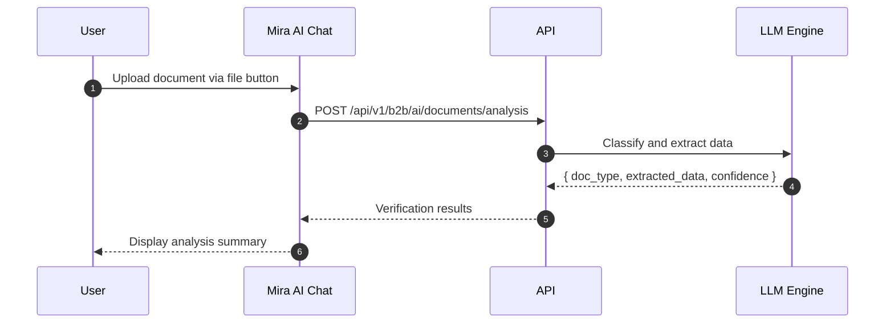
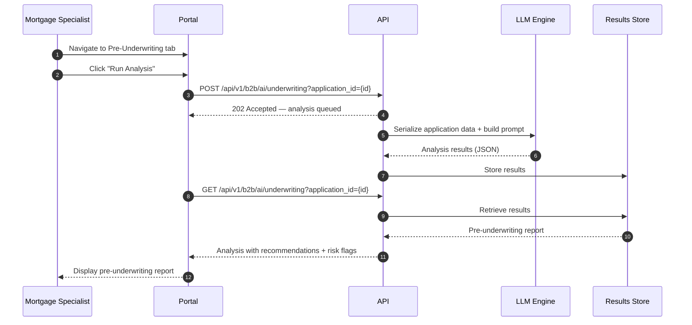
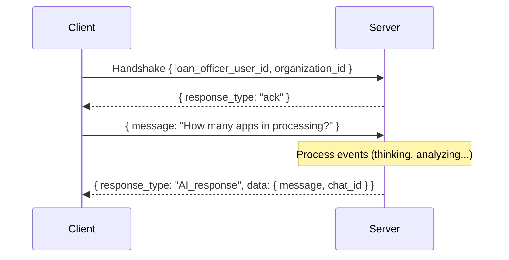
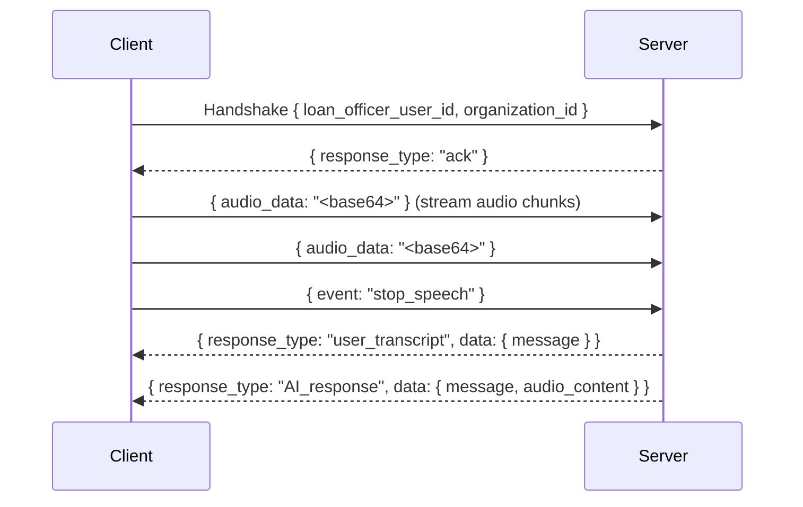

# AI Platform

The platform is powered by **Mira**, an AI assistant that provides context-aware mortgage assistance to both borrowers and mortgage specialists through chat, document analysis, voice input, and automated pre-underwriting.

---

## Overview

Mira operates through two specialized agent personas:

| Agent | User Role | Capabilities |
|-------|-----------|-------------|
| **Borrower Agent** | Consumer (B2C) | Application help, eligibility checks, form guidance, document analysis, calculators |
| **Mortgage Specialist Agent** | Mortgage Specialist / Admin (B2B) | Pipeline queries, borrower lookup, pre-underwriting, document analysis, cross-application analysis |

The appropriate agent is selected automatically based on the authenticated user's role and [market segment](#market-segments).

---

## Chat Interface

The chat interface is a persistent sidebar available on every page of the application.

### Layout

- **Header** — Platform branding with expand/collapse toggle
- **Message area** — Scrollable conversation with user messages (right-aligned) and AI responses (left-aligned)
- **Thinking indicator** — Shows AI reasoning steps and tool calls in progress
- **Input area** — Text input, voice recording button, file upload, and send button
- **Suggested prompts** — Shown when chat is empty

### Chat Modes

| Mode | User Role | AI Agent | Capabilities |
|------|-----------|----------|-------------|
| **Borrower Chat** | Consumer (B2C) | Borrower Agent | Application help, eligibility, form guidance, calculators |
| **Specialist Chat** | Mortgage Specialist / Admin (B2B) | Mortgage Specialist Agent | Pipeline queries, borrower lookup, pre-underwriting |

### Role-Based Routing

- B2B roles (Mortgage Specialist, Loan Processor, Organization Admin, Branch Admin) route to the **Mortgage Specialist Agent**
- B2C roles (Consumer) route to the **Borrower Agent**

---

## Borrower Agent Tools

The borrower-facing AI agent has access to the following capabilities:

| Tool | Display Label | Description |
|------|--------------|-------------|
| Borrower Details | "Getting your details" | Retrieves borrower profile and application data |
| Application Selector | — | Lists all borrower loan applications; auto-selects if only one, prompts if multiple |
| Document Analysis | "Reading your files" | Analyzes uploaded documents for verification and data extraction |
| Document Requirements | — | Determines which documents are required based on the borrower's profile (employment type, loan type, etc.) |
| Knowledge Base | "Searching the Knowledge Base" | Searches Canadian mortgage FAQs, Sagen and CMHC guidelines, policies, and loan programs |
| Form Assistant | "Updating your details" | Updates borrower profile fields conversationally (personal details, address, employment, income, assets, liabilities, real estate) |
| Mortgage Calculator | "Running Mortgage Calculations" | Computes mortgage payments, CMHC insurance premiums, amortization schedule, and PITI breakdown |
| Debt Service Calculator | "Running Debt Service Calculations GDS/TDS" | Calculates GDS and TDS ratios using income, housing costs, and liabilities |

:::info Planned Calculators
The following calculators are built and will be activated after upcoming database updates:
- **Land Transfer Tax Calculator** — Provincial land transfer tax estimates
- **Mortgage Insurance Calculator** — CMHC/Sagen insurance premium calculations
- **Rental Property Calculator** — Rental income and cash flow analysis
:::

### Pre-Approval (B2C)

When a borrower asks Mira to run a pre-approval or eligibility check, Mira automatically:

1. Reviews all mandatory application fields for completeness
2. Checks uploaded documents against the required document list
3. Validates that document data (name, income, employer) matches the borrower profile
4. Provides a summary of what's valid, what's missing, and what needs correction
5. Defers the final pre-approval decision to the assigned mortgage specialist

For the full borrower AI experience, see the [Borrower Portal — Mira AI](./b2c-borrower-portal#mira-ai) section.

---

## Mortgage Specialist Agent Tools

Mortgage specialists get all borrower tools (calculators, knowledge base, form assistant, document analysis) plus additional capabilities for managing borrowers and processing applications.

### Role-Based Access Control (RBAC)

Mira enforces role-based data scoping — each user only sees data within their authorized scope:

| Role | Data Scope |
|------|------------|
| **Organization Admin** | All branches, all specialists, all borrowers across the organization |
| **Branch Admin** | All specialists and borrowers within their branch |
| **Mortgage Specialist** | Borrowers assigned to them (their loan applications) |
| **Loan Processor** | Borrowers assigned to them (their loan applications) |

When a specialist opens a chat, Mira validates their role and presents only the borrowers, applications, and data they are authorized to access. If a user's role is not recognized, Mira provides admin contact details for escalation.

### Specialist-Specific Tools

| Tool | Description |
|------|-------------|
| **Borrower Management** | List borrowers by organization, branch, status, or specialist; select and review any authorized borrower |
| **Pipeline Queries** | Ask about application statuses, volumes, and workload |
| **Pre-Underwriting** | Run full pre-underwriting analysis: validate borrower details, verify documents, generate risk report |
| **Document Management** | Upload documents via chat, analyze specialist-uploaded files, assign documents to borrowers, check required document lists |
| **Cross-Borrower Analysis** | Compare and analyze multiple applications including co-borrower data |
| **Loan Restructuring** | AI assistance with restructuring loan terms and scenarios |
| **Missing Document Follow-ups** | AI-triggered follow-ups for missing or incomplete documentation |
| **Admin Escalation** | Retrieve contact details for branch admin or organization admin when escalation is needed |

### Co-Borrower Support

When an application has co-borrowers, Mira automatically retrieves details for all borrowers (primary + co-borrowers) and considers their combined income, assets, liabilities, and real estate in all calculations and pre-underwriting analysis.

### Example Interactions

- "Show me pre-underwriting for John Doe" — Mira searches for the borrower and runs the full pre-underwriting analysis
- "How many applications are in processing?" — Returns pipeline statistics
- "What documents are missing for the Smith application?" — Checks required documents against uploaded documents
- "Calculate the GDS/TDS for this borrower" — Computes gross and total debt service ratios using combined borrower data
- "Help me restructure this loan" — Guides through restructuring options
- "Upload this T4 for my borrower" — Analyzes and assigns the document to the selected borrower

For the full specialist AI experience, see the [Mortgage Specialist Portal — Mira AI](./b2b-loan-officer-portal#mira-ai-b2b) section.

---

## Document Analysis

### Upload and Analysis Flow



### Capabilities

- **Document type classification** — Automatic identification (T4, pay stub, bank statement, NOA, etc.)
- **Data extraction** — Income figures, account balances, employer information, dates
- **Cross-document consistency** — Flag discrepancies between uploaded documents and application data
- **Anomaly detection** — Highlight large deposits, income discrepancies, or missing information

### Supported Document Types

**Identity**
- Passport, driver's license, permanent resident card

**Income**
- Pay stubs, T4 slips, T1 returns, Notice of Assessment (NOA)
- Job letters, record of employment
- Business license, articles of incorporation, corporate tax (T2)

**Assets**
- Bank statements, void cheque
- Investment statements, gift letter, deposit receipt

**Property**
- Mortgage statements, tenant leases, recent appraisal
- Property tax proof, homeowners insurance, sales agreement

Documents are uploaded through the chat interface or the [Document Manager](./b2c-borrower-portal#document-manager). AI classification and data extraction run asynchronously in the background.

---

## Pre-Underwriting Analysis

The AI pre-underwriting engine analyzes complete loan applications and generates risk assessments. Pre-underwriting can be triggered through two paths:

1. **Via the Portal UI** — Queues an asynchronous analysis via the API
2. **Via Mira Chat** — The AI agent runs an inline analysis, validating borrower details and documents step by step

### Portal-Triggered Flow (Async API)



### Chat-Triggered Flow (Agent Inline)

When a mortgage specialist asks Mira to "run pre-underwriting for [borrower]", the agent executes a multi-step process automatically:

1. **Check existing reports** — Retrieve any prior pre-underwriting reports for the borrower
2. **Fetch borrower details** — Get the complete borrower profile (and co-borrower profiles if applicable)
3. **Determine required documents** — Check which documents are mandatory based on the borrower's profile (employment type, loan type, etc.)
4. **Analyze each document** — Read and validate every uploaded document, including chunked files
5. **Cross-validate** — Verify that borrower name, address, income, and employment in documents match the application data
6. **Application completeness** — Confirm all mandatory fields are filled for primary and co-borrowers
7. **Generate report** — Produce a structured pre-underwriting report with findings, recommendations, and risk flags
8. **Store results** — Save the versioned report for display in the Pre-Underwriting tab

All steps run automatically without waiting for user confirmation between steps. The report is stored and displayed in the portal's Pre-Underwriting tab.

### Analysis Categories

1. **Income Analysis** — Annual income calculation, year-over-year consistency (max 10% variance), source verification
2. **Personal Details Verification** — Citizenship, age verification, address consistency, 2-year address history
3. **Asset Verification** — Balance matching with bank statements, large deposit flagging (>50% monthly income)
4. **Credit Assessment** — Score evaluation, derogatory marks, GDS/TDS calculation
5. **Document Completeness** — Identify missing or incomplete documentation
6. **Document Validation** — Cross-reference document data against borrower profile data

### Output Format

```json
{
  "recommendations": [
    { "name": "Income Documentation", "value": "Request updated pay stubs" }
  ],
  "riskSummary": [
    { "name": "Borrower Profile", "value": "Stable, moderate income" },
    { "name": "Financial Stability", "value": "High credit score" }
  ],
  "remarks": [
    {
      "name": "Personal Details Verification",
      "children": [
        { "name": "Name Consistency", "value": "Confirmed", "status": "success" }
      ]
    }
  ]
}
```

### Triggering Pre-Underwriting

- **Via UI** — Navigate to the borrower profile → Pre-Underwriting tab → "Run Analysis"
- **Via Chat (Mortgage Specialist)** — Ask Mira: "Run pre-underwriting for [borrower name]"
- **Via Chat (Borrower)** — Ask Mira: "Run an eligibility check on my profile" (runs as pre-approval with final decision deferred to specialist)

For how pre-underwriting fits into the specialist workflow, see [Mortgage Specialist Portal — Pre-Underwriting](./b2b-loan-officer-portal#pre-underwriting).

---

## Voice AI

The platform includes real-time voice input and speech synthesis powered by Google Speech services.

### Speech-to-Text

1. Click the **microphone** button in the chat input
2. Speak your message — audio is streamed and transcribed
3. Stop speaking — the system finalizes the transcription
4. Message is sent automatically after finalization

### Supported Audio Formats

| MIME Type | Encoding |
|-----------|----------|
| `audio/wav` | LINEAR16 |
| `audio/mpeg` / `audio/mp3` | MP3 |
| `audio/flac` | FLAC |
| `audio/webm` | WEBM_OPUS |
| `audio/ogg` | OGG_OPUS |

### Text-to-Speech

When the user sends a message via voice input, Mira's response is automatically synthesized to audio:
- Audio plays automatically in the browser
- Synthesis supports configurable voice, speaking rate, pitch, and language
- Only triggered for voice-initiated messages (text-only messages do not produce audio)

---

## Chat Sessions & History

### Session Management

Each conversation is a chat session scoped to the authenticated user and (optionally) a specific borrower and loan application.

- **Session list** — Browse previous conversations with timestamps
- **Session loading** — Click to restore a previous conversation
- **New chat** — Start a fresh conversation
- **Auto-titling** — Sessions are automatically titled based on the first message

### Context Building

Every AI interaction includes context:
- Borrower ID (when in an application context)
- Organization ID
- User role and permissions
- Market segment (CA-B2B, CA-B2C, etc.)
- Session metadata (borrower name, loan application ID)

This ensures Mira only accesses data the user is authorized to see.

---

## Form Auto-Fill

When the AI determines it should update a form field, it returns structured data that automatically populates the corresponding form fields in the portal. Borrowers can say things like "Help me fill in my personal details" and Mira will guide them through each field conversationally.

---

## Market Segments

The AI platform supports multiple market segments, which influence agent behavior, product knowledge, and regulatory context:

| Segment | Description |
|---------|-------------|
| `CA-B2B` | Canadian mortgage specialist experience |
| `CA-B2C` | Canadian borrower experience |
| `US-B2B` | US mortgage specialist experience |
| `US-B2C` | US borrower experience |

The market segment is determined automatically based on tenant configuration and can also be specified via the WebSocket connection.

---

## AI API Reference

### B2B Chat Sessions

| Method | Endpoint | Description |
|--------|----------|-------------|
| `POST` | `/api/v1/b2b/ai/chat/sessions` | Create chat session |
| `GET` | `/api/v1/b2b/ai/chat/sessions` | List chat sessions |
| `GET` | `/api/v1/b2b/ai/chat/sessions/{id}` | Get chat session |
| `GET` | `/api/v1/b2b/ai/chat/sessions/{id}/messages` | List chat messages |
| `POST` | `/api/v1/b2b/ai/chat/sessions/{id}/messages` | Send chat message |

### B2C Chat Sessions

| Method | Endpoint | Description |
|--------|----------|-------------|
| `POST` | `/api/v1/b2c/ai/chat/sessions` | Create consumer chat session |
| `GET` | `/api/v1/b2c/ai/chat/sessions` | List consumer chat sessions |
| `GET` | `/api/v1/b2c/ai/chat/sessions/{id}` | Get consumer chat session |
| `GET` | `/api/v1/b2c/ai/chat/sessions/{id}/messages` | List consumer chat messages |
| `POST` | `/api/v1/b2c/ai/chat/sessions/{id}/messages` | Send consumer chat message |
| `GET` | `/api/v1/b2c/ai/chat/borrower-context` | Resolve borrower context for consumer |

### Document Analysis

```
POST /api/v1/b2b/ai/documents/analysis
```

**Content-Type**: `multipart/form-data`

| Parameter | Type | Required | Description |
|-----------|------|----------|-------------|
| `file` | file | Yes | Document to analyze |
| `application_id` | string | No | Associated loan application ID |

**Response** `200`:
```json
{
  "document_type": "t4",
  "confidence": 0.95,
  "extracted_fields": {
    "employer_name": "Acme Corp",
    "employee_name": "John Doe",
    "employment_income": 85000.00,
    "tax_year": 2024
  },
  "verification_status": "verified",
  "issues": []
}
```

### Pre-Underwriting

**Queue analysis (async)**:

```
POST /api/v1/b2b/ai/underwriting?application_id={id}
```

**Authorization**: Mortgage Specialist+

**Response** `202 Accepted`:
```json
{
  "status": "queued",
  "application_id": "app-uuid",
  "message": "Pre-underwriting analysis has been queued"
}
```

**Retrieve results**:

```
GET /api/v1/b2b/ai/underwriting?application_id={id}
```

**Authorization**: Mortgage Specialist+

**Response** `200`:
```json
{
  "recommendations": [...],
  "riskSummary": [...],
  "remarks": [...]
}
```

### Speech

| Method | Endpoint | Description |
|--------|----------|-------------|
| `POST` | `/api/v1/b2b/ai/speech/transcribe` | Convert audio to text (Google Speech-to-Text) |
| `POST` | `/api/v1/b2b/ai/speech/synthesize` | Convert text to audio (Google Text-to-Speech) |

### Health

```
GET /api/v1/b2b/ai/health
```

Returns `{"status": "ok"}` when the AI service is available.

---

## WebSocket API

### Connection

```
ws://host/ws/ai/chat
```

**Query Parameters** (optional):

| Parameter | Type | Description |
|-----------|------|-------------|
| `market_segment` | string | Market segment (e.g., `CA-B2B`) |
| `include_debug` | boolean | Include AI reasoning in responses |

### Handshake

The first JSON message from the client must include:

```json
{
  "loan_officer_user_id": "user-id",
  "organization_id": "org-id",
  "borrower_id": "borrower-id",
  "loan_application_id": "app-id",
  "user_role": "loanOfficer",
  "market_segment": "CA-B2B"
}
```

| Field | Required | Description |
|-------|----------|-------------|
| `loan_officer_user_id` | Yes | Authenticated user identifier |
| `organization_id` | Yes | Organization/tenant identifier |
| `borrower_id` | No | Borrower to associate with the session |
| `loan_application_id` | No | Loan application to associate with the session |
| `user_role` | No | Frontend role (`loanOfficer`, `loanProcessor`, `organization`, `branchAdmin`) |
| `market_segment` | No | Market segment override |

### Client → Server Messages

Messages are sent as JSON payloads:

**Text message:**
```json
{
  "message": "What documents are missing?",
  "chat_id": "session-uuid"
}
```

**Audio streaming:**
```json
{
  "audio_data": "<base64-encoded-audio>",
  "language_code": "en-CA",
  "sample_rate": 16000,
  "content_type": "audio/wav"
}
```

**End audio (triggers transcription + AI response):**
```json
{
  "event": "stop_speech"
}
```

### Server → Client Response Types

All server messages use the `response_type` field:

| Response Type | Description |
|---------------|-------------|
| `ack` | Connection established successfully |
| `AI_response` | AI assistant response (includes message, chat_id, metadata, and optional audio) |
| `chat_created` | New chat session created (includes chat_id) |
| `user_transcript` | Speech-to-text transcription result |
| `reasoning` | AI reasoning steps (only when `include_debug` is enabled) |
| `error` | Error occurred |
| `warning` | Non-fatal warning |

### Text Chat Flow



### Voice Chat Flow



---

## Related Pages

- [Borrower Portal](./b2c-borrower-portal) — How borrowers interact with Mira, including tools, calculators, and document upload
- [Mortgage Specialist Portal](./b2b-loan-officer-portal) — How specialists use AI for pre-underwriting, document analysis, and pipeline management
- [Credit Reports](./credit) — Credit data used in pre-underwriting analysis
- [POS Flow Reference](./pos-flow-reference) — All AI-related sequence diagrams
