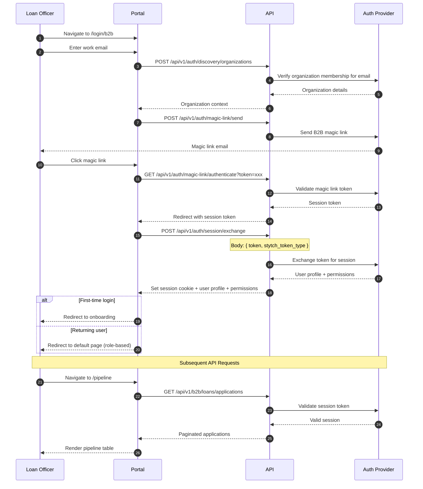
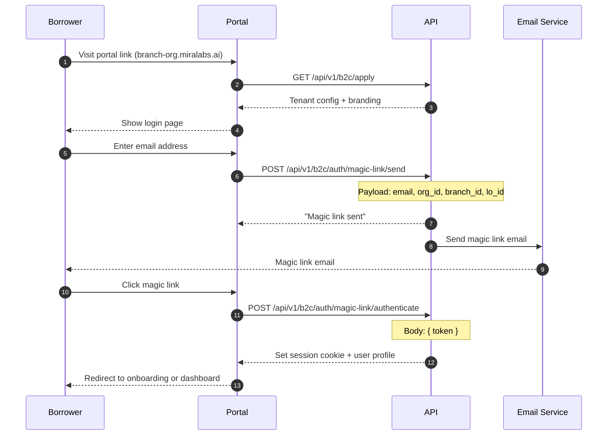
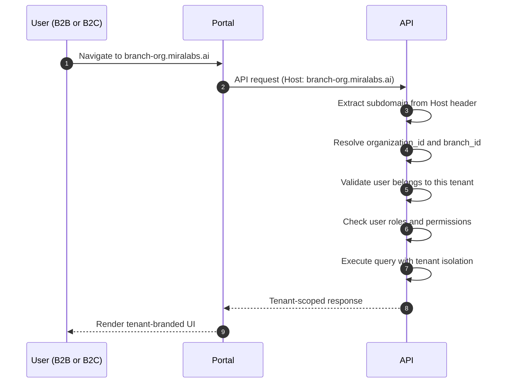
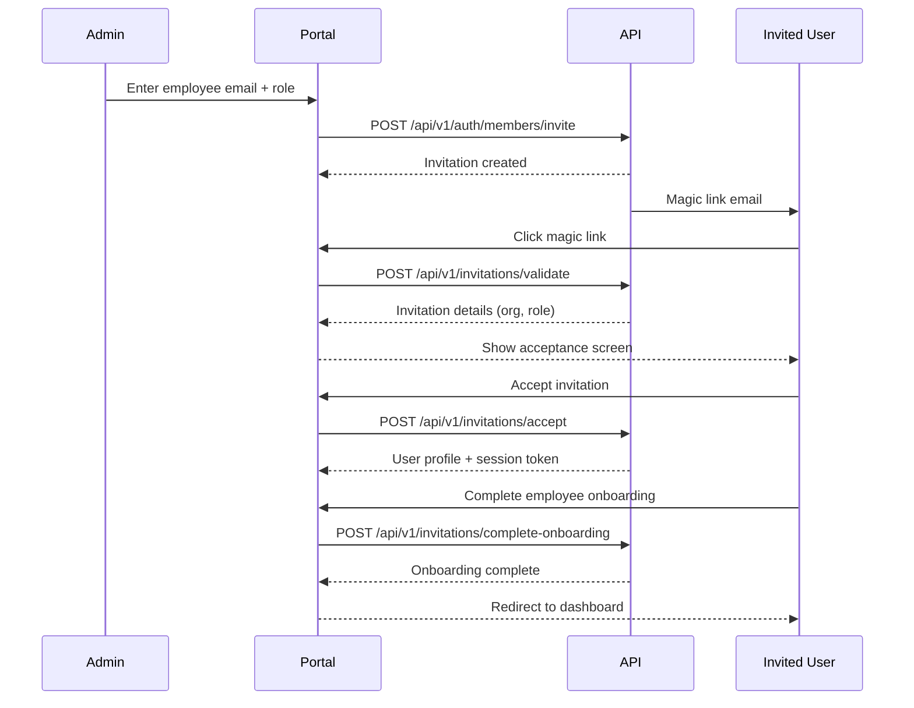

# Authentication

The platform uses passwordless (magic link) and password-based authentication. It supports two distinct authentication flows: **B2B** for employees (loan officers, admins, processors) and **B2C** for consumers (borrowers/home buyers).

---

## B2B Login Flow

The B2B flow authenticates loan officers and administrative staff with organization membership verification.



### Organization Discovery

When a B2B user enters their email, the system:

1. Calls `POST /api/v1/auth/discovery/organizations` with the email
2. Resolves the organization the user belongs to
3. Returns the organization context (each user belongs to exactly one organization)
4. If no matching organization is found, the login is rejected

### Post-Login Routing

| Role | Default Page |
|------|-------------|
| Organization Admin | `/dashboard` |
| Branch Admin | `/dashboard` |
| Loan Officer | `/loanInformation` |
| Loan Processor | `/pipeline` |

---

## B2C Login Flow

The B2C flow authenticates borrowers using passwordless magic links — no organization membership is required.



### Consumer Onboarding

New borrowers complete a two-step onboarding:

1. **Loan Purpose** — Select Purchase or Refinance
2. **Employment Type** — Select Full-Time, Part-Time, Self-Employed, Retired, or Seasonal

After completion, `POST /api/v1/b2c/auth/complete-onboarding` is called, and the user is redirected to their pipeline.

---

## RBAC Hierarchy

The platform enforces role-based access control across all API endpoints:

| Role | Scope | Description |
|------|-------|-------------|
| `ADMIN` | Organization | Full organization-level user and branch management |
| `LOAN_OFFICER_ADMIN` | Branch | Manages loan officers and branch-level operations |
| `BRANCH_ADMIN` | Branch | Branch-level administration |
| `LOAN_OFFICER` | Organization | Standard loan processing and pipeline access |
| `LOAN_PROCESSOR` | Organization | Document and pipeline processing |
| `READ_ONLY` | Organization | View-only access for compliance and auditing |
| `CONSUMER` | B2C | End-user / borrower self-service |

Endpoints are protected by role requirements. Attempting to access an endpoint without the required role returns a `403 Forbidden` response.

---

## Multi-Tenant Architecture

The platform is multi-tenant. Each organization operates on its own branded subdomain, and all data is isolated by tenant.



### Key Points

- Tenant is resolved from the request hostname (e.g., `branch-org.miralabs.ai`)
- All database queries are automatically scoped to the resolved tenant
- Cross-tenant access attempts are blocked and logged
- Branch-level isolation further restricts data within an organization

---

## Organization & Branch Setup

### Organization Registration

1. **Organization Creation** — Register with a unique name and slug; the system provisions the organization and assigns a subdomain
2. **Branch Setup** — Configure at least one branch with a name and slug; each branch gets its own subdomain (`branch-org.miralabs.ai`)
3. **Admin User** — The first user is assigned the Organization Admin role
4. **Invite Team Members** — Admins invite employees via email; invitees receive a magic link to complete onboarding

### Branch Hierarchy

```
Acme Mortgage (organization)
  |-- Main Branch (branch)
  |-- East Coast Office (branch)
  |-- West Coast Office (branch)
```

Each branch can host its own consumer-facing portal with custom branding, loan officer assignments, and B2C invite links.

### Inviting Employees



---

## Session Management

The platform uses **HttpOnly session cookies** for authentication. No JWT tokens are stored in browser-accessible storage. This provides:

- Protection against XSS-based token theft
- Automatic session management by the browser
- Cookie-based CSRF protection

### Session Lifecycle

- **Creation** — Session is created upon successful magic link or password authentication
- **Validation** — Each API request validates the session cookie against the auth provider
- **Expiration** — Sessions expire after a configurable duration; expired sessions redirect to `/session-timeout`
- **Revocation** — Explicit logout invalidates the session immediately

### Logout Endpoints

- **B2B Logout:** `POST /api/v1/auth/session/revoke`
- **B2C Logout:** `POST /api/v1/b2c/auth/session/revoke`

---

## Authentication API Reference

### Discover Organizations

Find organizations associated with an email address.

```
POST /api/v1/auth/discovery/organizations
```

**Query Parameter**: `email` (string, required)

**Response** `200`:
```json
{
  "organization_id": "org_abc123",
  "name": "Acme Mortgage",
  "subdomain": "acme"
}
```

### Send Magic Link (B2B)

```
POST /api/v1/auth/magic-link/send
```

**Request Body**:
```json
{
  "email_address": "user@acme.com",
  "organization_id": "org_abc123"
}
```

Optional fields: `login_redirect_url`, `signup_redirect_url`

### Authenticate Magic Link (B2B)

```
GET /api/v1/auth/magic-link/authenticate?token={token}
```

**Response**: `302 Redirect` to `{frontend_url}/auth/callback?session_token={token}`

### Password Authentication

```
POST /api/v1/auth/password/authenticate
```

**Request Body**:
```json
{
  "email_address": "user@acme.com",
  "password": "secure-password-123",
  "organization_id": "org_abc123",
  "session_duration_minutes": 1440
}
```

`session_duration_minutes` is optional (default: 1440 minutes / 24 hours).

**Rate Limiting**: 5 failed attempts per email or 20 per IP triggers a 15-minute lockout. Response includes `Retry-After` header.

### Exchange Session Token

```
POST /api/v1/auth/session/exchange
```

**Request Body**:
```json
{
  "token": "session-token-from-callback",
  "stytch_token_type": "magic_links"
}
```

**Response** `200`:
```json
{
  "access_token": "eyJ...",
  "user": {
    "id": "user_abc123",
    "email": "user@acme.com",
    "firstName": "Jane",
    "lastName": "Smith",
    "role": "ADMIN",
    "organizationId": "org_abc123",
    "permissions": ["LOAN_CREATE", "LOAN_VIEW", "USER_MANAGE"]
  },
  "expires_at": "2025-06-01T12:00:00Z",
  "is_first_login": false,
  "needs_onboarding": false
}
```

### Verify Session

```
POST /api/v1/auth/session/verify
```

**Request Body**:
```json
{
  "session_token": "..."
}
```

### Revoke Session (Logout)

```
POST /api/v1/auth/session/revoke
```

**Request Body**:
```json
{
  "session_token": "..."
}
```

---

## Common Headers

| Header | Required | Description |
|--------|----------|-------------|
| `Authorization` | Yes (authenticated) | `Bearer <access_token>` |
| `Content-Type` | Yes (POST/PUT) | `application/json` |

### Standard Response Format

**Success:**
```json
{
  "status": 200,
  "message": "Success",
  "data": { ... }
}
```

**Error:**
```json
{
  "detail": "Human-readable error message"
}
```

### HTTP Status Codes

| Code | Meaning |
|------|---------|
| `200` | Success |
| `201` | Created |
| `400` | Bad Request — validation error or business rule violation |
| `401` | Unauthorized — missing or invalid session |
| `403` | Forbidden — insufficient role/permissions |
| `404` | Not Found |
| `429` | Too Many Requests — rate limited |
| `500` | Internal Server Error |

---

## Link Generation & Security

The platform generates secure, time-limited authentication links for all user types. Each link is protected by multiple layers of security:

| User Type | Link Method | Key Security |
|-----------|------------|-------------|
| **Consumer (Borrower)** | Passwordless magic link | Signed state, one-time token, 60-min expiry |
| **Employee (LO, Admin)** | Magic link or password | Tracked invitation, 7-day expiry, breach-checked passwords |
| **Co-Borrower** | Passwordless magic link | Auto-linked to loan application, one-time token |

All magic links are generated through **Stytch** (the platform's identity provider) and include:

- **One-time use** — Tokens are consumed on first click and cannot be replayed
- **Cryptographic integrity** — Tenant context (organization, branch, loan officer) is signed server-side to prevent tampering
- **Server-side state** — Sensitive context is cached server-side and never exposed in the link URL
- **Time-based expiry** — Links expire after 60 minutes; B2B invitations expire after 7 days
- **Account lockout** — 10 failed authentication attempts trigger a 1-hour lockout

For a complete description of how links are generated, validated, and secured for each user type, see **[Link Generation & Security](./link-generation-and-security)**.

---

## Related Pages

- [Link Generation & Security](./link-generation-and-security) — Detailed link generation flows, Stytch integration, and security architecture
- [Borrower Portal](./b2c-borrower-portal) — What happens after B2C login
- [Loan Officer Portal](./b2b-loan-officer-portal) — What happens after B2B login
- [POS Flow Reference](./pos-flow-reference) — LO Auth and Multi-Tenant diagrams
