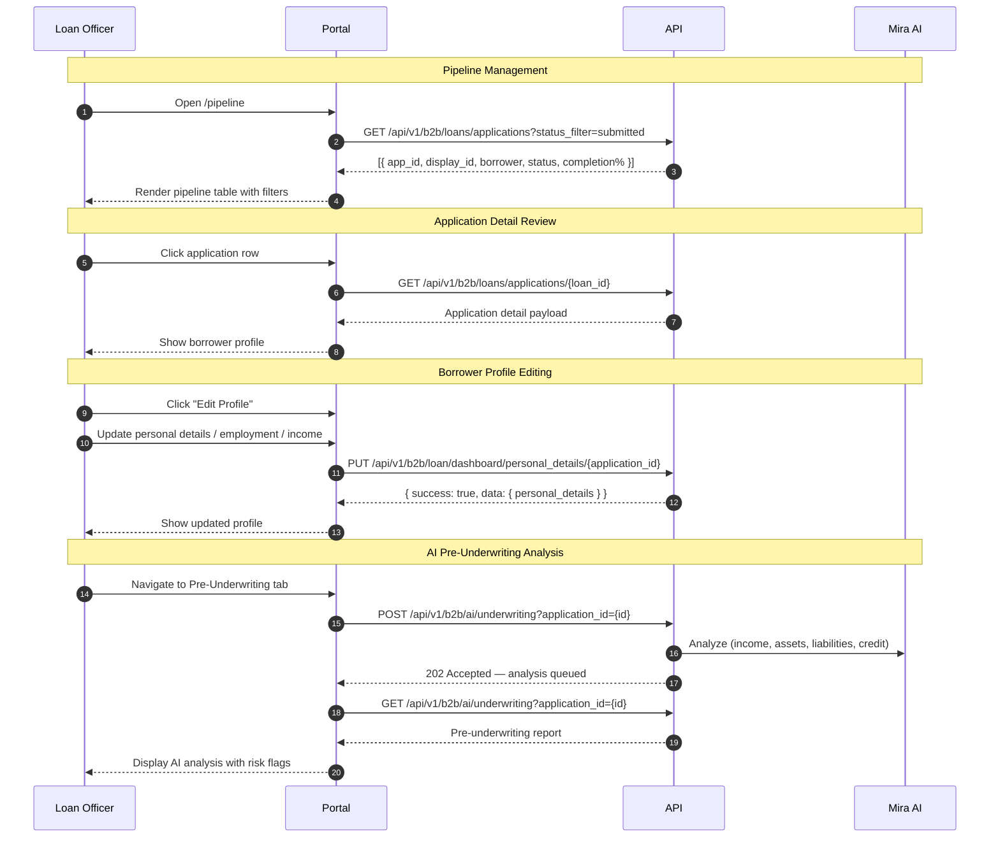
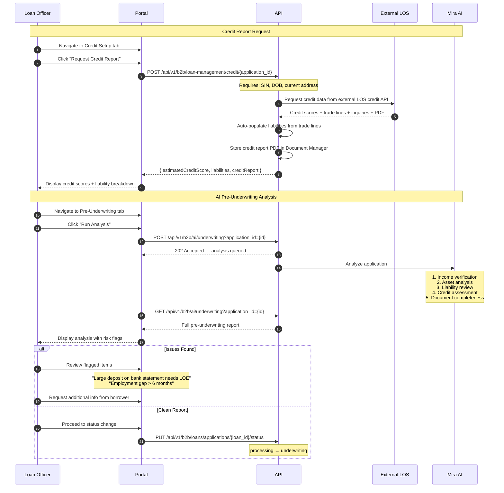
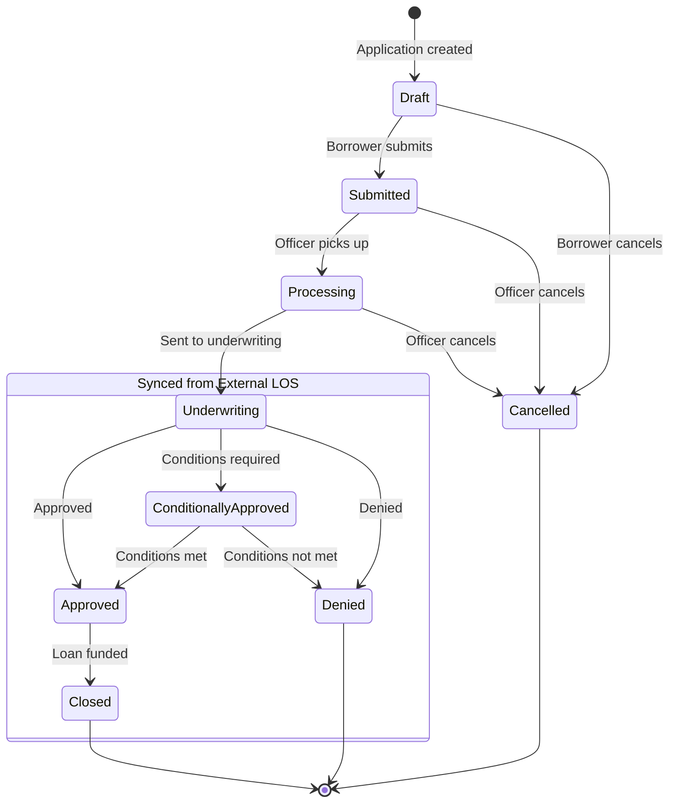

# Loan Officer Portal (B2B)

The Loan Officer Portal provides a complete workflow for managing loan applications — from initial pipeline review through credit analysis, AI-powered underwriting, and submission to an external LOS.

---

## Dashboard

The officer dashboard (`/dashboard`) provides an overview of:

- Active loan applications count
- Applications by status breakdown
- Recent activity feed
- Key performance metrics
- Quick actions (new application, search borrower)

---

## Pipeline Management

The pipeline view (`/pipeline`) displays all loan applications within the officer's scope.



### Pipeline Features

- **List view** — All applications with key data at a glance
- **Status indicators** — Color-coded by loan status
- **Sorting** — By date, amount, status, or borrower name
- **Filtering** — By status, date range, loan officer, branch
- **Completion percentage** — Visual indicator of application completeness
- **Quick actions** — Open profile, change status, view documents

### Pipeline Query Parameters

| Parameter | Type | Description |
|-----------|------|-------------|
| `status_filter` | string | Filter by status (draft, submitted, processing, etc.) |
| `loan_officer_id` | int | Filter by loan officer |
| `branch_id` | string | Filter by branch |
| `skip` | int | Records to skip (default: 0) |
| `limit` | int | Max records to return (default: 100, max: 1000) |

---

## Creating Applications

Loan officers can create new loan applications directly:

```
POST /api/v1/b2b/loans/applications
```

The system generates a display ID (`ML-{YY}{SEQUENCE}`) and creates the application in `draft` status.

---

## Borrower Profile Review

When an officer clicks an application from the pipeline, they see a tabbed profile view:

### Borrower Profile

Full personal details in read-only or edit mode:

- Personal information (name, DOB, SIN, contact info)
- Current and previous addresses
- Employment and income details
- Assets and liabilities summary
- Housing expenses
- Real estate owned (REO)

Officers can toggle **Edit Profile** to modify any section. Changes are saved via the borrower dashboard API.

### Documents

Document management center:

- View all uploaded documents with status
- Upload additional documents on behalf of the borrower
- Review AI-analyzed document results
- Approve or reject documents with feedback
- View document version history

### Credit Setup

Credit report integration (via external LOS):

- Request credit reports through the external LOS credit API
- Auto-populate liabilities from credit data
- Store credit report PDFs in the Document Manager
- View credit scores from Equifax Canada and TransUnion Canada
- Review credit history and derogatory marks
- Evaluate debt service ratios (GDS/TDS)

> **Note:** Credit data is retrieved from the external LOS credit API. The platform does not pull credit reports directly from bureaus.

### Pre-Underwriting

AI-powered analysis:

- Comprehensive application risk assessment
- Income verification results
- Asset and liability analysis
- Recommendations for strengthening the application
- Flagged items requiring attention

### Loan Tools

- Quick Price — Generate product rate comparisons
- Amortization Schedule — Monthly payment breakdown
- Loan Comparison — Compare different loan scenarios
- Quote Download — Generate and download offer PDFs

---

## Co-Borrower Management

Loan officers can view and manage co-borrowers on any application:

```
GET /api/v1/b2b/loans/applications/{application_id}/coborrowers
```

Returns the list of co-borrowers with type counts and limits:

- Maximum 1 spouse co-borrower per application
- Maximum 4 external co-borrowers per application
- Maximum 5 total borrowers per application

Co-borrower invitations are initiated through the B2C co-borrower API. The primary borrower or loan officer invites a co-borrower by email.

---

## Adding Leads

Officers can invite new borrowers to the platform by sharing a personalized invite link:

```
https://branch-org.miralabs.ai/login/consumer?org_id=xxx&branch_id=xxx&lo_id=xxx
```

This link pre-assigns the borrower to the officer's branch and loan officer ID.

---

## Document Manager

Officers manage the document lifecycle for their applications:

1. **Upload documents** — Upload on behalf of borrowers via `POST /api/v1/b2b/documents/upload`
2. **Review uploads** — View uploaded documents with AI classification and extracted data
3. **Approve** — Approve verified documents via `POST /api/v1/b2b/documents/{document_id}/approve`
4. **Reject** — Reject with a reason via `POST /api/v1/b2b/documents/{document_id}/reject`
5. **Re-upload cycle** — Borrowers are notified to re-upload rejected documents

### Document Aggregation

Officers can view documents grouped by category for a loan application:

```
GET /api/v1/b2b/documents/aggregate/loan/{loan_id}
```

### Document Versioning

```
GET /api/v1/b2b/documents/versions/{document_id}
```

Returns the version history for a document, including version number, creation date, and who created each version.

---

## Credit Reports

Credit data is sourced from the external LOS credit API. When an officer requests a credit report, the platform calls the external LOS, which returns credit scores, trade lines, and inquiries. The platform then:

1. Auto-populates the borrower's **liabilities** section with trade line data
2. Stores the credit report **PDF** in the Document Manager
3. Makes the credit data available for **pre-underwriting** analysis



---

## Pre-Underwriting AI Analysis

The AI pre-underwriting analysis covers:

1. **Income Analysis** — Calculate and verify income from all sources; check year-over-year consistency
2. **Personal Details Verification** — Citizenship, age, address consistency
3. **Asset Verification** — Balance matching, large deposit flagging (>50% monthly income)
4. **Liability Review** — Monthly payment validation, payoff requirements
5. **Credit Assessment** — Score evaluation, derogatory marks, GDS/TDS calculation
6. **Document Completeness** — Identify missing or incomplete documentation

The analysis is **asynchronous** — the POST returns `202 Accepted` and queues the analysis. Results are retrieved via GET once processing completes.

---

## Mira AI (B2B)

Loan officers have access to the Mira AI chat sidebar with capabilities tailored for loan processing.

### Chat Interface

Officers can open a chat session linked to a specific borrower and application:

- **Ask questions** — "What documents are missing for this application?", "Summarize the borrower's income sources", "What are the risk flags on this file?"
- **Get form assistance** — Mira can help fill in borrower profile fields based on conversational input
- **Analyze documents** — Submit documents for AI-powered verification and data extraction
- **Restructure loans** — Get AI assistance with restructuring loan terms and scenarios
- **Pipeline assistance** — Get help navigating and managing the pipeline view
- **Missing document follow-ups** — AI-triggered notifications and follow-ups for missing or incomplete documentation

### Voice Input & Output

- **Speech-to-Text** — Dictate messages using the microphone button; audio is transcribed via Google Speech-to-Text
- **Text-to-Speech** — Mira can read responses aloud via Google Text-to-Speech
- **WebSocket chat** — Real-time combined speech/text chat via WebSocket connection

### Tools & Calculators

Mira AI includes all the tools and calculators available to borrowers, plus additional officer-specific capabilities:

- **Mortgage Payment Calculator** — Estimate monthly payments
- **Debt Service Ratio Calculator** — Calculate GDS and TDS ratios
- **Land Transfer Tax Calculator** — Provincial land transfer tax estimates
- **Mortgage Insurance Calculator** — CMHC insurance premiums
- **Rental Property Analysis** — Evaluate rental income and cash flow
- **Pre-Underwriting Analysis** — Trigger and review AI risk assessments
- **Document Analysis** — AI-driven document classification and data extraction

---

## Application Status Management

Officers update application status via the dropdown in the borrower profile header.

### Loan Status Lifecycle

The platform manages statuses up through **Underwriting**. Post-underwriting statuses are synced from the external LOS.



### Status Definitions

| Status | Managed By | Description |
|--------|-----------|-------------|
| `draft` | Platform | Application started but not yet submitted |
| `submitted` | Platform | Borrower has completed and submitted the application |
| `processing` | Platform | Loan officer is reviewing and gathering documentation |
| `underwriting` | Platform | Application sent to underwriting |
| `approved` | External LOS | Loan has been fully approved |
| `conditionally_approved` | External LOS | Approved with conditions that must be met |
| `denied` | External LOS | Application has been denied |
| `closed` | External LOS | Loan has closed (funded) |
| `cancelled` | Platform | Application withdrawn or cancelled |

### External LOS Sync

Applications are synced to the external LOS for processing beyond underwriting:

```
POST /api/v1/b2b/integrations/fundmore/sync/{application_id}
```

Documents can also be synced separately:

```
POST /api/v1/b2b/integrations/fundmore/sync-documents/{application_id}
```

Status updates from the external LOS flow back to the platform via webhook integration.

---

## Consumer Management

Admins and loan officers can manage borrowers (consumers) from the B2B portal:

| Method | Endpoint | Description |
|--------|----------|-------------|
| `POST` | `/api/v1/b2b/loan/consumer/` | List consumers (with filtering by LO, status, search) |
| `PUT` | `/api/v1/b2b/loan/consumer/{user_id}` | Update consumer info, assign LO or processor |
| `DELETE` | `/api/v1/b2b/loan/consumer/{user_id}` | Deactivate a consumer (soft delete) |

---

## Role-Specific Access Matrix

| Feature | Loan Officer | LO Admin | Loan Processor | Branch Admin | Org Admin |
|---------|-------------|----------|----------------|-------------|-----------|
| Dashboard | Yes | Yes | Yes | Yes | Yes |
| Pipeline | Yes | Yes | Yes | Yes | Yes |
| Borrower Profile (edit) | Yes | Yes | Limited | Yes | Yes |
| Documents | Yes | Yes | Yes | Yes | Yes |
| Credit Setup | Yes | Yes | No | Yes | Yes |
| Pre-Underwriting | Yes | Yes | Yes | Yes | Yes |
| Quick Price | Yes | Yes | No | Yes | Yes |
| Mira AI Chat | Yes | Yes | Yes | Yes | Yes |
| Reports | No | No | No | Yes | Yes |
| User Management | No | Yes | No | Yes | Yes |
| Admin Panel | No | No | No | No | Yes |
| Submit to LOS | Yes | Yes | No | Yes | Yes |

---

## Loan Officer API Reference

### Pipeline — List Applications

```
GET /api/v1/b2b/loans/applications
```

**Authorization**: Loan Officer+

### Create Application

```
POST /api/v1/b2b/loans/applications
```

### Get Application Detail

```
GET /api/v1/b2b/loans/applications/{loan_id}
```

### Update Application

```
PUT /api/v1/b2b/loans/applications/{loan_id}
```

### Update Application Status

```
PUT /api/v1/b2b/loans/applications/{loan_id}/status
```

### Approve / Reject Application

```
POST /api/v1/b2b/loans/applications/{loan_id}/approve
POST /api/v1/b2b/loans/applications/{loan_id}/reject
```

### Analytics

```
GET /api/v1/b2b/loans/analytics
```

**Authorization**: Admin+

### Borrower Profile

| Method | Endpoint | Description |
|--------|----------|-------------|
| `PUT` | `/api/v1/b2b/loan/dashboard/personal_details/{application_id}` | Update personal details |
| `PUT` | `/api/v1/b2b/loan/dashboard/loan/{application_id}` | Update loan details |
| `PUT` | `/api/v1/b2b/loan/dashboard/declaration/{application_id}` | Update declarations |
| `PUT` | `/api/v1/b2b/loan/dashboard/demographics/{application_id}` | Update demographics |
| `PUT` | `/api/v1/b2b/loan/dashboard/status_admin/{application_id}` | Update status (admin) |
| `GET` | `/api/v1/b2b/loan/dashboard/view_lead_details` | View lead summary |
| `GET` | `/api/v1/b2b/loan/dashboard/transaction_details/{user_id}` | Transaction details |
| `GET` | `/api/v1/b2b/loan/dashboard/housing_expense/{user_id}` | Housing expense |

### Employment & Income

| Method | Endpoint | Description |
|--------|----------|-------------|
| `GET` | `/api/v1/b2b/loan-management/employment-income/{application_id}` | Get employment profiles |
| `PUT` | `/api/v1/b2b/loan-management/employment-income/{application_id}` | Upsert employment profiles |

### Assets

| Method | Endpoint | Description |
|--------|----------|-------------|
| `GET` | `/api/v1/b2b/loan-management/assets/{application_id}` | Get borrower assets |
| `PUT` | `/api/v1/b2b/loan-management/assets/{application_id}` | Upsert borrower assets |
| `DELETE` | `/api/v1/b2b/loan-management/assets/{application_id}/{asset_id}` | Delete asset |

### Liabilities

| Method | Endpoint | Description |
|--------|----------|-------------|
| `GET` | `/api/v1/b2b/loan-management/liabilities/{application_id}` | Get borrower liabilities |
| `PUT` | `/api/v1/b2b/loan-management/liabilities/{application_id}` | Upsert liabilities |
| `DELETE` | `/api/v1/b2b/loan-management/liabilities/{application_id}/{liability_id}` | Delete liability |

### Credit

```
POST /api/v1/b2b/loan-management/credit/{application_id}
```

Requests credit data from the external LOS credit API. Returns credit scores and auto-populates liabilities.

### Co-Borrowers

| Method | Endpoint | Description |
|--------|----------|-------------|
| `GET` | `/api/v1/b2b/loans/applications/{application_id}/coborrowers` | List co-borrowers |
| `GET` | `/api/v1/b2b/loans/applications/{application_id}/borrower/{borrower_id}/personal-details` | Get co-borrower details |

### B2B Document Endpoints

| Method | Endpoint | Description |
|--------|----------|-------------|
| `POST` | `/api/v1/b2b/documents/upload` | Upload document (multipart/form-data) |
| `GET` | `/api/v1/b2b/documents/list` | List documents (with filters) |
| `GET` | `/api/v1/b2b/documents/loan/{loan_id}` | List documents for a loan |
| `GET` | `/api/v1/b2b/documents/aggregate/loan/{loan_id}` | Documents grouped by category |
| `GET` | `/api/v1/b2b/documents/{document_id}` | Get document details |
| `GET` | `/api/v1/b2b/documents/download/{document_id}` | Download document |
| `PUT` | `/api/v1/b2b/documents/update` | Update document metadata |
| `PUT` | `/api/v1/b2b/documents/update_status` | Update document status |
| `POST` | `/api/v1/b2b/documents/{document_id}/approve` | Approve document |
| `POST` | `/api/v1/b2b/documents/{document_id}/reject` | Reject document |
| `DELETE` | `/api/v1/b2b/documents/{document_id}` | Delete document |
| `POST` | `/api/v1/b2b/documents/search` | Search documents |
| `GET` | `/api/v1/b2b/documents/versions/{document_id}` | Document version history |
| `POST` | `/api/v1/b2b/documents/process` | Trigger AI processing on a document |

### AI Endpoints

| Method | Endpoint | Description |
|--------|----------|-------------|
| `POST` | `/api/v1/b2b/ai/chat/sessions` | Create chat session |
| `GET` | `/api/v1/b2b/ai/chat/sessions` | List chat sessions |
| `GET` | `/api/v1/b2b/ai/chat/sessions/{session_id}` | Get chat session |
| `GET` | `/api/v1/b2b/ai/chat/sessions/{session_id}/messages` | List messages |
| `POST` | `/api/v1/b2b/ai/chat/sessions/{session_id}/messages` | Send message |
| `POST` | `/api/v1/b2b/ai/documents/analysis` | AI document analysis |
| `POST` | `/api/v1/b2b/ai/speech/transcribe` | Speech to text |
| `POST` | `/api/v1/b2b/ai/speech/synthesize` | Text to speech |
| `GET` | `/api/v1/b2b/ai/underwriting?application_id={id}` | Get underwriting summary |
| `POST` | `/api/v1/b2b/ai/underwriting?application_id={id}` | Queue underwriting analysis (202) |

### Quick Price

| Method | Endpoint | Description |
|--------|----------|-------------|
| `POST` | `/api/v1/b2b/loan/price/get_quick_price` | Generate quick price product list |
| `POST` | `/api/v1/b2b/loan/price/compare_offer_by_user_input` | Compare offers |
| `POST` | `/api/v1/b2b/loan/price/compare_products_quick_price` | Compare products |
| `POST` | `/api/v1/b2b/loan/price/send_quote` | Send quote to borrower |

### Loan Tools

| Method | Endpoint | Description |
|--------|----------|-------------|
| `GET` | `/api/v1/b2b/loan/tools/get_amortization_schedule/application/{id}` | Amortization schedule |
| `GET` | `/api/v1/b2b/loan/tools/get_current_offer/application/{id}` | Current offer |
| `POST` | `/api/v1/b2b/loan/tools/compare_offer_by_user_input` | Compare offers |
| `POST` | `/api/v1/b2b/loan/tools/download_quote/application/{id}` | Download quote PDF |

### Session Initialization

```
GET /api/v1/b2b/session/init
```

Returns all reference data and user context in a single call to minimize page load requests.

---

## Related Pages

- [Authentication](./authentication) — B2B login and RBAC
- [AI Platform](./ai-platform) — Full Mira AI capabilities
- [Credit Reports](./credit) — Credit integration details
- [External LOS](./external-los) — Submitting loans to external systems
- [POS Flow Reference](./pos-flow-reference) — Pipeline, Credit, and Status Lifecycle diagrams
