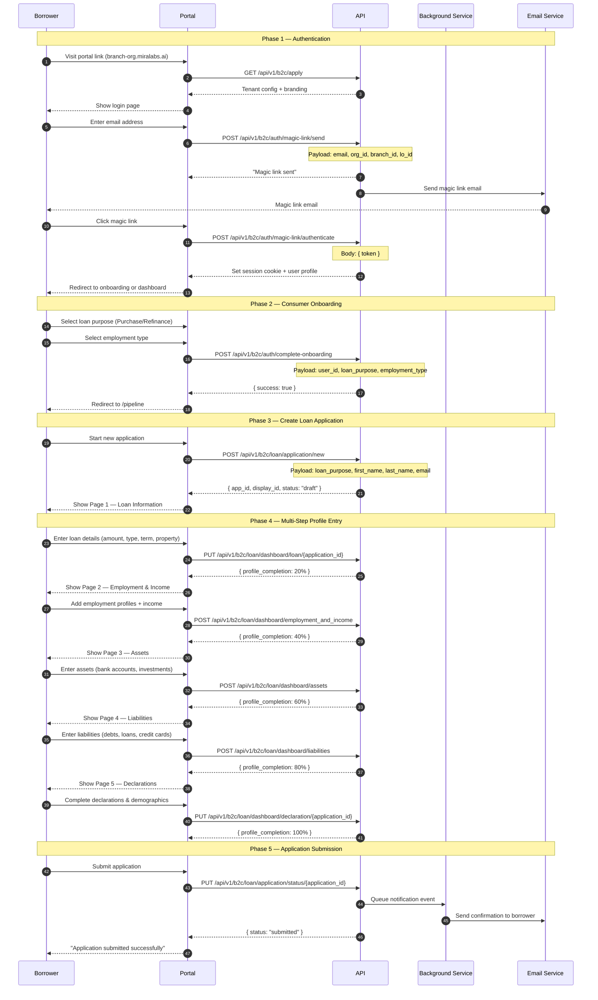
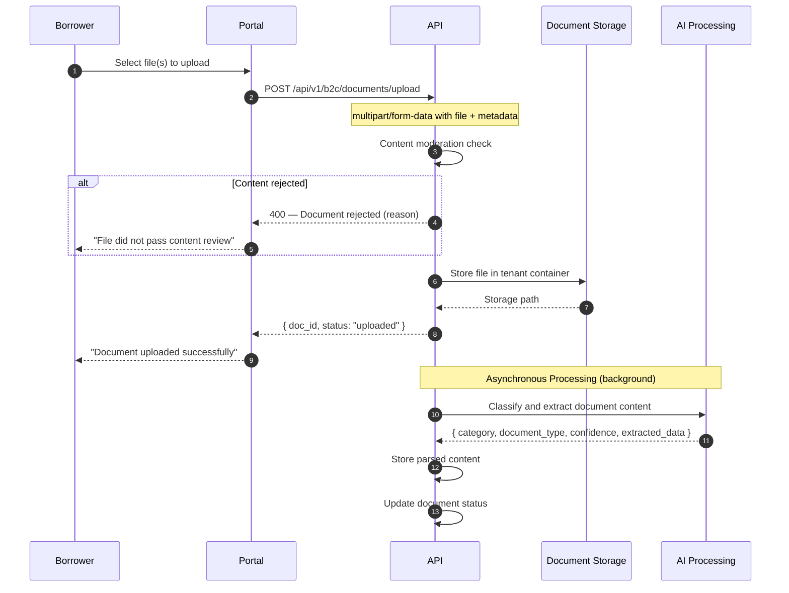

# Borrower Portal (B2C)

The Borrower Portal is a self-service application experience where borrowers complete loan applications, upload documents, interact with Mira AI, and track their application status.

---

## Dashboard Overview

After authentication and onboarding, borrowers access their dashboard with the following sections:

| Route | Page | Description |
|-------|------|-------------|
| `/dashboard` | Dashboard | Overview with key metrics and quick actions |
| `/pipeline` | My Applications | List of all loan applications with status |
| `/documents` | Documents | Document upload and management |
| `/profile` | Profile | Personal profile settings |

---

## My Applications

The pipeline view (`/pipeline`) shows all of a borrower's applications. Borrowers can have **multiple concurrent applications** for different loan purposes and property types.

- **Application Display ID** — Human-readable ID in the format `ML-{YY}{SEQUENCE}` (e.g., `ML-2500045`)
- **Current Status** — Draft, Submitted, Processing, Underwriting, Approved, Denied, Closed
- **Completion Percentage** — Visual indicator of profile completeness
- **Last Updated Date** — When the application was last modified
- **Loan Officer** — Assigned loan officer name and contact details

### Creating a New Application

From the pipeline view, borrowers can start a new application at any time by selecting their loan purpose (Purchase, Refinance, etc.). Each application is tracked independently with its own profile completion, documents, and status.

```
GET /api/v1/b2c/loan/pipeline/applications
```

Returns all applications where the borrower is the primary applicant or a co-borrower.

---

## Loan Application Process

The complete flow from arrival at the portal through multi-step application submission:



### Profile Sections

| Section | Content |
|---------|---------|
| **Personal Details** | Name, date of birth, SIN, contact info, addresses, citizenship, marital status |
| **Loan Information** | Loan type, amount, property value, down payment, term, property address |
| **Employment & Income** | Current/previous employers, base income, overtime, bonus, other income |
| **Assets** | Bank accounts, investments, retirement funds, seller/lender credits |
| **Liabilities** | Credit cards, auto loans, student loans, other debts |
| **Declarations** | Borrower declarations and demographic information |

---

## Document Manager

Borrowers upload required documents through the Documents page or the Mira AI chat interface.

### Upload Flow



Documents are uploaded synchronously (the borrower gets immediate confirmation), while AI classification and data extraction run asynchronously in the background.

### Document Lifecycle

```
Uploaded → Processing → Requires Review → Approved / Rejected
```

| Status | Description |
|--------|-------------|
| **Uploaded** | File stored, awaiting AI processing |
| **Processing** | AI is classifying and extracting data |
| **Requires Review** | Flagged for loan officer review (low confidence or manual flag) |
| **Approved** | Loan officer has approved the document |
| **Rejected** | Document rejected — borrower can re-upload a replacement |

### Document Requirements

Loan officers can request specific documents from a borrower. These appear as pending requirements on the borrower's Documents page. When the borrower uploads a matching document, the requirement status updates to received.

### Bulk Upload

Borrowers can upload multiple files at once. The system:

1. Creates a background processing job
2. Splits merged PDFs into individual documents (if detected)
3. Classifies each document by type and category
4. Reports progress via real-time updates
5. Returns the created documents once processing completes

```
POST /api/v1/b2c/documents/bulk/upload
```

Job status can be polled:

```
GET /api/v1/b2c/documents/bulk/jobs/{job_id}
GET /api/v1/b2c/documents/bulk/jobs/{job_id}/documents
```

### Supported Document Types

**Identity**
- Passport, driver's license, permanent resident card
- Student visa, work visa, birth certificate

**Income**
- Recent pay stubs, job letter, record of employment
- T4 (last 2 years), T1 (last 2 years), NOA (last 2 years)
- Business license, articles of incorporation, corporate tax (T2)

**Assets**
- Bank statements (3 or 12 months), void cheque
- Investment statements, gift letter, deposit receipt

**Property**
- Mortgage statements, tenant leases, recent appraisal
- Property tax proof, homeowners insurance, sales agreement

Documents are automatically classified and analyzed by AI upon upload, extracting key data such as income figures, account balances, and employer information. Lender-only document categories are not visible to borrowers.

### Document Versioning

When a borrower re-uploads a document, a new version is created. Previous versions are retained for audit purposes. The most recent version is always the active one.

---

## Mira AI

The AI chat sidebar is always available to borrowers. Mira AI provides conversational assistance, tools, and document analysis throughout the application process.

### Ask Questions
- "What documents do I need to upload?"
- "What is my estimated monthly payment?"
- "Do I qualify for CMHC-insured mortgage?"
- "What is the current status of my application?"
- "What would my GDS and TDS ratios be?"

### Tools & Calculators

Mira AI includes built-in tools and calculators that borrowers can access through the chat:

- **Mortgage Payment Calculator** — Estimate monthly payments based on loan amount, rate, and amortization
- **Debt Service Ratio Calculator** — Calculate GDS (Gross Debt Service) and TDS (Total Debt Service) ratios
- **Land Transfer Tax Calculator** — Estimate provincial land transfer tax based on property value and location
- **Mortgage Insurance Calculator** — Calculate CMHC insurance premiums based on down payment and purchase price
- **Rental Property Analysis** — Evaluate rental income potential and cash flow

### Get Form Assistance
- "Help me fill in my loan information"
- Mira can auto-fill form fields based on conversational input

### Use Voice Input
1. Click the **microphone** button
2. Speak your question or request
3. See the live transcription in the input field
4. Message is sent automatically when you stop speaking

### Upload and Analyze Documents
1. Click the **file upload** button (paper clip icon)
2. Select a document
3. Mira analyzes the document and provides document type identification, extracted data, and consistency checks

### Suggested Prompts
When the chat is empty, suggested prompts are displayed:
- "I can run an eligibility check on your profile."
- "Looking to move forward? I can request a pre-approval."
- "Ready to apply for a loan? Let me guide you."
- "Compare different loan options to find what suits you."

---

## Loan Tools

The following standalone tools are available to borrowers outside of Mira AI:

| Tool | Endpoint | Description |
|------|----------|-------------|
| Amortization Schedule | `GET /api/v1/b2c/loan/tools/get_amortization_schedule_consumer` | Monthly payment breakdown over the loan term |
| Current Offer | `GET /api/v1/b2c/loan/tools/get_current_offer_consumer` | Summary of the current loan offer |
| Loan Comparison | `POST /api/v1/b2c/loan/tools/compare_offer_by_user_input_consumer` | Compare loan scenarios by adjusting parameters |
| Download Quote | `POST /api/v1/b2c/loan/tools/download_quote_consumer/application/{id}` | Download a loan quote as PDF |

---

## Co-Borrower Support

The platform supports co-borrower applications with a structured invite and onboarding flow:

1. **Invite** — The primary borrower invites a co-borrower by providing their name, email, and relationship (e.g., spouse)
2. **Authenticate** — The co-borrower receives a magic link, authenticates, and completes their own onboarding
3. **Contribute** — The co-borrower fills in their own personal details, employment, income, assets, and liabilities
4. **Combined Analysis** — Both borrower profiles are included in credit and underwriting analysis
5. **Primary Control** — The primary borrower controls application submission

### Co-Borrower Limits

- Maximum 1 spouse co-borrower per application
- Maximum 4 external co-borrowers per application
- Maximum 5 total borrowers per application

### Co-Borrower Endpoints

| Method | Endpoint | Description |
|--------|----------|-------------|
| `POST` | `/api/v1/b2c/loan/co_borrower/invite` | Invite a co-borrower |
| `GET` | `/api/v1/b2c/loan/{loan_id}/co_borrowers` | List co-borrowers on an application |
| `DELETE` | `/api/v1/b2c/loan/co_borrower/{coborrower_id}` | Remove a co-borrower |
| `POST` | `/api/v1/b2c/loan/co_borrower/complete-onboarding` | Co-borrower completes onboarding |

---

## Application Status Tracking

As the loan progresses, borrowers receive status updates:

| Event | Notification |
|-------|-------------|
| Application received | Confirmation of submission |
| Processing started | Officer has picked up your application |
| Documents requested | Additional documentation needed |
| Conditions issued | Conditional approval with required items |
| Approved | Loan approved |
| Denied | Application denied with explanation |
| Closed | Loan funded and closed |

---

## Borrower API Reference

### Get Apply Context

Returns tenant context for initializing the borrower portal.

```
GET /api/v1/b2c/apply
```

**Authorization**: Public (tenant derived from hostname)

**Response** `200`:
```json
{
  "tenant_id": "org-uuid",
  "organization_name": "Acme Mortgage",
  "subdomain": "acme",
  "logo_url": "https://...",
  "branding": { ... }
}
```

### Get Borrower Profile

```
GET /api/v1/b2c/loan/dashboard/borrower_profile/{application_id}
```

**Authorization**: Consumer (authenticated)

**Response** `200`:
```json
{
  "status": 200,
  "message": "Success",
  "data": {
    "personal_details": {
      "firstName": "John",
      "lastName": "Doe",
      "email": "john@example.com",
      "phoneNumber": "555-0123",
      "DOB": "1985-06-15"
    },
    "loan_details": {
      "loanAmount": 300000,
      "purchasePrice": 400000,
      "downPayment": 100000,
      "propertyAddress": "123 Main St"
    },
    "employment": { ... },
    "addresses": { ... },
    "declarations": { ... },
    "demographics": { ... },
    "activeBorrowerRole": "primary",
    "isPrimaryBorrower": true,
    "hasCoBorrower": false
  }
}
```

### Update Personal Details

```
PUT /api/v1/b2c/loan/dashboard/personal_details/{application_id}
```

### Update Loan Details

```
PUT /api/v1/b2c/loan/dashboard/loan/{application_id}
```

### Get Transaction Details

```
GET /api/v1/b2c/loan/dashboard/transaction_details/{user_id}
```

### Consumer Document Endpoints

| Method | Endpoint | Description |
|--------|----------|-------------|
| `GET` | `/api/v1/b2c/documents/list` | List documents (supports filters) |
| `GET` | `/api/v1/b2c/documents/aggregate/loan?applicationId={id}` | Documents grouped by category |
| `POST` | `/api/v1/b2c/documents/upload` | Upload document (multipart/form-data) |
| `GET` | `/api/v1/b2c/documents/download/{document_id}` | Download document |
| `PUT` | `/api/v1/b2c/documents/update` | Update document metadata |
| `DELETE` | `/api/v1/b2c/documents/{document_id}` | Delete document |

**Upload Form Fields**:

| Field | Type | Required | Description |
|-------|------|----------|-------------|
| `file` | file | Yes | Document file |
| `title` | string | No | Document title (defaults to filename) |
| `applicationId` | string | No | Loan application ID |
| `borrowerId` | string | No | Borrower ID |
| `documentTypeCode` | string | No | Document type code (e.g., `t4_last_2_years`) |
| `document_category_id` | int | No | Category ID |
| `document_type_id` | int | No | Type ID |

### Session Initialization

Returns all reference data and user context in a single call to avoid multiple individual requests on page load.

```
GET /api/v1/b2c/session/init
```

---

## Related Pages

- [Authentication](./authentication) — B2C login flow details
- [AI Platform](./ai-platform) — Full Mira AI capabilities
- [Notifications](./notifications) — How borrowers receive updates
- [POS Flow Reference](./pos-flow-reference) — Borrower Application and Document Lifecycle diagrams
