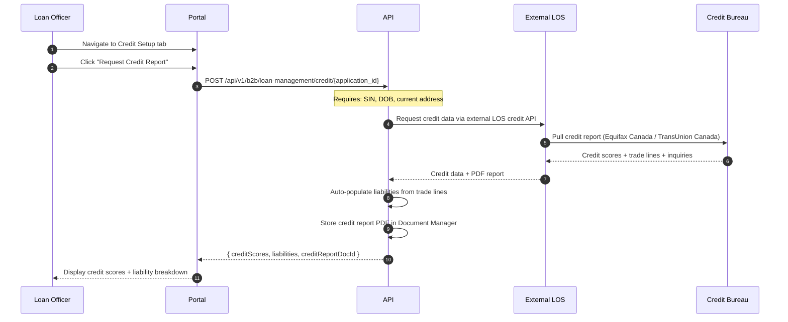

# Credit Reports

:::info Integration In Progress
The credit report integration is being finalized with the external LOS credit API. This page documents the planned capabilities and integration flow. Endpoints and behavior will be updated as the integration is completed.
:::

---

## Overview

Credit data is sourced from the **external LOS credit API** — the platform does not pull credit reports directly from Canadian credit bureaus. When a loan officer requests a credit report, the platform calls the external LOS, which handles the bureau interaction and returns the results.

This approach provides:

- Centralized credit management through the LOS
- Consistent credit data between the platform and the LOS
- No need for separate bureau credentials or agreements

---

## Planned Integration Flow



### Step-by-Step

1. **Request** — Loan officer clicks "Request Credit Report" from the Credit Setup tab. The borrower must have SIN, date of birth, and current address on file.
2. **External LOS Call** — The platform sends the request to the external LOS credit API, which handles the bureau pull.
3. **Auto-Populate Liabilities** — Trade line data (open accounts, balances, monthly payments) is automatically imported into the borrower's liabilities section.
4. **Store PDF** — The credit report PDF returned by the LOS is stored in the Document Manager and linked to the application.
5. **Pre-Underwriting** — The credit data feeds into the AI pre-underwriting analysis for GDS/TDS calculation and risk assessment.

---

## Planned Capabilities

### Credit Score Display

- View scores from **Equifax Canada** and **TransUnion Canada**
- Consolidated score summary with the score used for underwriting highlighted

### Trade Line Analysis

- Open accounts, balances, and payment history
- Derogatory marks (collections, judgments, late payments)
- Account age and credit utilization

### Liability Auto-Import

- Automatically populate the borrower's liabilities section from credit trade lines
- Officers can review and adjust imported liabilities before saving
- Reduces manual data entry and ensures consistency with credit data

### Debt Service Ratio Calculation

- **GDS (Gross Debt Service)** — Housing costs as a percentage of gross income
- **TDS (Total Debt Service)** — Total debt obligations as a percentage of gross income
- Calculated using credit-reported liabilities and verified income

### Credit Alert Flags

- Collections and judgments
- Late payment patterns
- High credit utilization
- Recent credit inquiries that may affect eligibility

---

## Credit Endpoint

```
POST /api/v1/b2b/loan-management/credit/{application_id}
```

**Authorization**: Loan Officer+

**Description**: Requests credit data from the external LOS credit API for the borrower associated with the given application. Returns credit scores and trade line data. Auto-populates liabilities and stores the credit report PDF.

**Requirements**: The borrower must have SIN, date of birth, and current address on file before a credit request can be initiated.

---

## Related Pages

- [Loan Officer Portal](./b2b-loan-officer-portal) — Credit Setup tab within borrower review
- [AI Platform](./ai-platform) — Pre-underwriting analysis uses credit data
- [External LOS](./external-los) — External LOS integration details
- [POS Flow Reference](./pos-flow-reference) — Credit & Pre-Underwriting diagram
