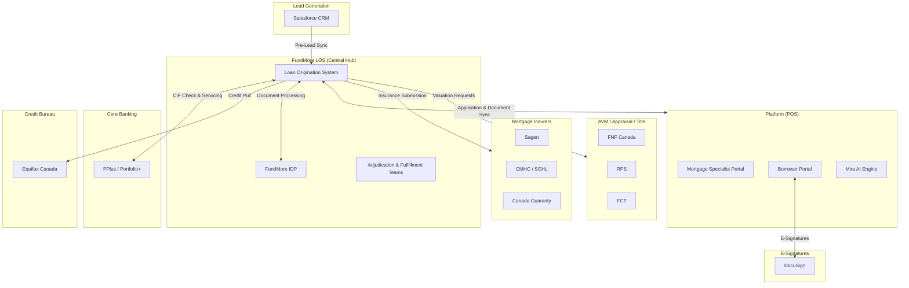
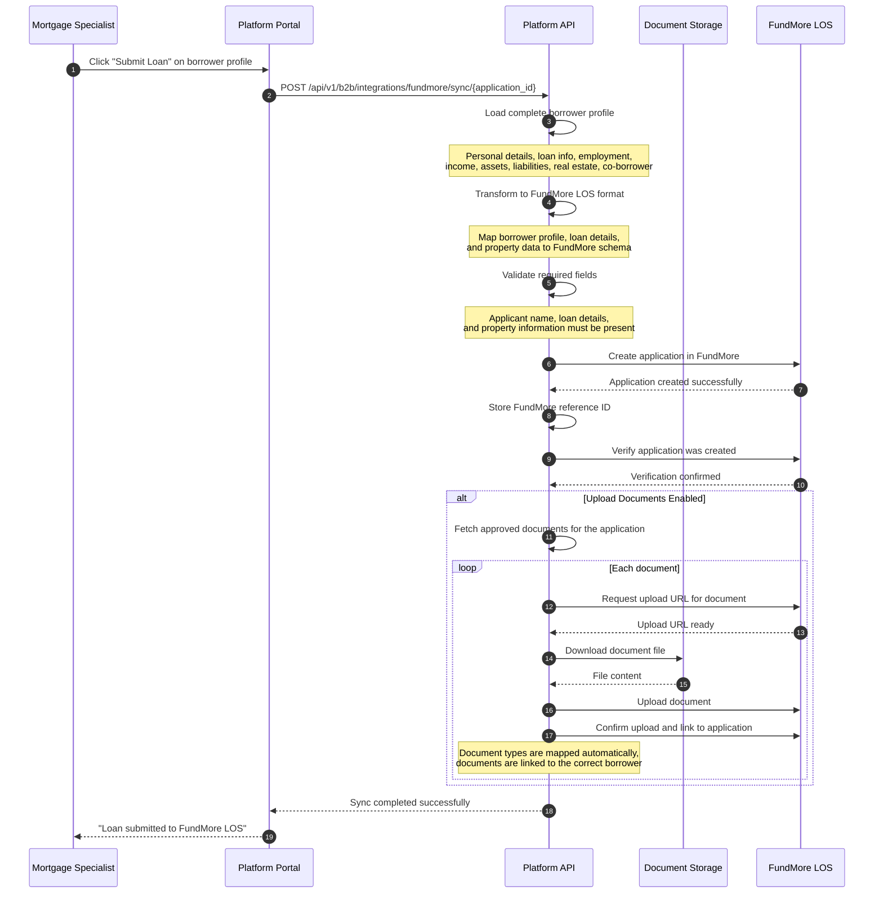

# FundMore LOS Integration

The platform integrates with **FundMore LOS** as the central loan origination hub. All external service access — credit, appraisals, insurers, core banking — flows through FundMore LOS APIs. The platform does not integrate directly with these external services.

---

## Integration Architecture



### Key Principle

The platform communicates **only with FundMore LOS APIs**. FundMore LOS handles all interactions with external services (credit bureaus, insurers, appraisal providers, core banking, etc.). This provides:

- **Single integration point** — One API connection between the platform and FundMore LOS
- **Centralized data** — All loan data stays consistent between the platform and the LOS
- **No separate credentials** — External service credentials are managed within FundMore LOS
- **Unified workflow** — Adjudication and fulfillment teams (underwriters, documentation specialists, QA, fulfillment, risk, finance) work within FundMore LOS alongside the data synced from the platform

---

## Lead Generation (Salesforce)

:::info Roadmap — Integration Planned
The Salesforce lead generation integration is being defined in collaboration with the end client. This section documents the planned flow.
:::

### Planned Flow

1. **Lead Origination** — Financial advisors and other lead generators create leads in Salesforce CRM
2. **Lead Details** — Each lead includes:
   - Advisor name and advisor code
   - Customer first name, last name, email address, phone numbers
   - Postal code
   - Mortgage purpose (Purchase, Refinance, Switch, etc.)
   - Advisor Selling Code (DSC)
   - Related mortgage specialist
3. **Pre-Lead Sync** — Salesforce pushes lead data to FundMore LOS
4. **Platform Trigger** — FundMore LOS calls the platform's new lead API to initiate the onboarding process
5. **Consumer Onboarding** — The platform sends a consumer invitation and begins the borrower onboarding workflow

---

## Application & Document Sync

This is the current integration between the platform and FundMore LOS. When a mortgage specialist submits a loan, the platform transforms the application data to FundMore's schema format and syncs it along with approved documents.

### Sync Flow



### Submission Requirements

- Borrower profile should be at or near 100% completion
- Required borrower data: personal details, loan information, employment, income, assets, and liabilities
- Documents should be reviewed and approved by the mortgage specialist before submission

### What Gets Synced

The platform maps the complete borrower profile to FundMore's LOS format:

| Data Section | Details |
|---|---|
| Personal details | Name, date of birth, SIN, citizenship status, marital status, current and previous addresses |
| Co-borrower | Same profile structure as the primary applicant |
| Employment & income | Employer details, income, Canadian income types (CPP, OAS, child benefit, etc.) |
| Assets | RRSP, TFSA, FHSA, stocks, bonds, mutual funds, savings, and other financial assets |
| Liabilities | Credit bureau and manually entered liabilities (credit cards, loans, lines of credit) |
| Real estate owned | Existing property holdings with market values and occupancy details |
| Loan details | Requested amount, interest rate, term, closing date, rate type (fixed, variable, etc.) |
| Down payment | Amount and source (personal savings, RRSP, gift, sale of existing property) |
| Property details | Property type, dwelling style, construction, heating, water, sewage, and tenure |

### API Reference — Application Sync

```
POST /api/v1/b2b/integrations/fundmore/sync/{application_id}
```

**Authorization**: Mortgage Specialist+

**Query Parameters**:

| Parameter | Type | Default | Description |
|---|---|---|---|
| `upload_documents` | boolean | `false` | Also sync documents after application creation |

**Response** `200`:
```json
{
  "status": 200,
  "message": "Sync completed",
  "data": {
    "success": true,
    "fundmore_application_id": "the FundMore LOS application reference"
  }
}
```

### API Reference — Document Sync

Sync documents separately from the application. Useful for uploading new or additional documents after the initial application sync.

```
POST /api/v1/b2b/integrations/fundmore/sync-documents/{application_id}
```

**Authorization**: Mortgage Specialist+

**Request Body**:
```json
{
  "fundmore_application_id": "optional — auto-resolved if omitted",
  "borrower_id": "optional — filter to a specific borrower's documents",
  "document_ids": ["optional — filter to specific documents"]
}
```

All body fields are optional. If `fundmore_application_id` is omitted, it is resolved automatically from a previous application sync. If `document_ids` is omitted, all documents for the application are synced.

**Response** `200`:
```json
{
  "status": 200,
  "message": "Document sync completed",
  "data": {
    "success": true,
    "uploaded_count": 5,
    "errors": []
  }
}
```

### Document Handling

During document sync, the platform automatically maps document types to FundMore's document catalog and links each document to the correct borrower in the FundMore application.

---

## Credit Integration (Equifax)

:::info Roadmap — Integration Planned
Credit integration will use FundMore LOS's existing Equifax Canada connection. See [Credit Reports](./credit) for the planned capabilities and integration flow.
:::

FundMore LOS has an existing integration with **Equifax Canada** for credit bureau pulls. The platform will use FundMore's credit API to:

- Request credit reports for borrowers
- Receive credit scores and trade line data
- Auto-populate liabilities from trade lines
- Store credit report PDFs in the Document Manager

The platform does not connect to credit bureaus directly. All credit requests are routed through FundMore LOS.

---

## AVM, Appraisals & Title Insurance

:::info Roadmap — Integration Planned
AVM, appraisal, and title insurance integrations will use FundMore LOS's existing provider connections. The full workflow and UI/UX are being defined.
:::

FundMore LOS connects to the following valuation and title providers through a bank API layer:

| Service | Providers |
|---|---|
| Automated Valuation Models (AVM) | FNF Canada, RPS |
| Appraisals | FNF Canada, RPS |
| Closing & Title Insurance | FCT |

The platform will access these services through FundMore's APIs. Planned capabilities include:

- **AVM requests** — Automated property valuations for quick assessments
- **Appraisal ordering** — Full appraisal requests with status tracking
- **Title insurance** — Title search and insurance ordering for closing

---

## End Client Proprietary Tools

:::info Roadmap — Integration Planned
End client proprietary tools will be integrated through FundMore LOS APIs. The full workflow and use cases are being defined with a proper implementation plan.
:::

Custom tools specific to the end client will be accessible through FundMore's API layer. This integration will be defined based on the client's specific tooling requirements and business processes.

---

## Products & Rate Sheets

:::info Roadmap — Integration Planned
Product and rate sheet integration will use FundMore LOS APIs. The full workflow and use cases are being defined in collaboration with the end client. See [Product & Pricing](./product-pricing) for planned capabilities.
:::

Product offerings and rate sheets from the end client will be sourced through FundMore LOS. Planned capabilities include:

- **Product search** — Query available products based on loan parameters (amount, LTV, amortization, property type)
- **Rate options** — View rates, terms, and payment estimates
- **Scenario comparison** — Compare product/rate combinations
- **Fee structures** — Product-specific fee schedules and calculation rules

---

## PPlus Core Banking (Portfolio+)

:::info Roadmap — Integration Planned
The PPlus Core Banking integration is managed by FundMore LOS. The platform will have visibility into the sync status.
:::

FundMore LOS integrates with **PPlus (Portfolio+)** core banking system for:

- **CIF Check** — Customer Information File lookup to identify existing account holders
- **Existing Accounts** — Retrieve existing banking relationship data
- **Servicing Push** — Once an application is complete, FundMore LOS pushes it back to PPlus for loan servicing

---

## Mortgage Insurers

:::info Roadmap — Integration Planned
Mortgage insurance integrations are managed by FundMore LOS. The platform will surface insurance status and requirements within the application workflow.
:::

FundMore LOS integrates with Canadian mortgage insurers:

| Insurer | Description |
|---|---|
| **Sagen** | Private mortgage insurer |
| **CMHC** (Canada Mortgage and Housing Corporation) | Government mortgage insurer |
| **Canada Guaranty** | Private mortgage insurer |

Mortgage insurance is required for high-ratio mortgages (down payment less than 20%). The platform's AI pre-underwriting analysis factors in insurance requirements when assessing applications.

---

## FundMore IDP (Document Processing)

:::info Roadmap — Integration Planned
FundMore IDP integration for intelligent document processing is being defined.
:::

**FundMore IDP** (Intelligent Document Processing) provides automated document classification and data extraction. FundMore LOS connects bidirectionally with IDP for:

- Document classification and categorization
- Data extraction from uploaded documents (income statements, identification, property records)
- Document validation and completeness checks

---

## DocuSign (E-Signatures)

:::info Roadmap — Integration Planned
DocuSign integration for e-signatures is being defined.
:::

The borrower portal will integrate with **DocuSign** for electronic signature workflows, enabling borrowers to sign required mortgage documents digitally during the application process.

---

## Webhook System

The platform provides a webhook system for delivering real-time event notifications to external systems. Organizations can subscribe to specific event types and receive HTTP callbacks when events occur.

### Event Types

| Category | Event | Description |
|---|---|---|
| **Loan** | `loan.created` | New loan application created |
| | `loan.submitted` | Application submitted for review |
| | `loan.status_changed` | Application status updated |
| | `loan.approved` | Application approved |
| | `loan.rejected` | Application rejected |
| | `loan.funded` | Loan funded |
| | `loan.closed` | Loan closed |
| **Document** | `document.uploaded` | Document uploaded |
| | `document.requested` | Document requested from borrower |
| | `document.approved` | Document approved by reviewer |
| | `document.rejected` | Document rejected by reviewer |
| **Borrower** | `borrower.created` | New borrower profile created |
| | `borrower.updated` | Borrower details updated |
| | `borrower.consent_given` | Borrower consent recorded |
| **Application** | `application.started` | Borrower started an application |
| | `application.completed` | Borrower completed an application |
| | `application.abandoned` | Application abandoned |

Wildcard patterns are supported (e.g., `loan.*` subscribes to all loan events).

### Subscription Management

| Method | Endpoint | Authorization | Description |
|---|---|---|---|
| `GET` | `/api/v1/b2b/webhooks/event-types` | Any authenticated | List available event types |
| `POST` | `/api/v1/b2b/webhooks/subscriptions` | Admin | Create subscription (returns HMAC secret) |
| `GET` | `/api/v1/b2b/webhooks/subscriptions` | Admin+ | List all subscriptions |
| `GET` | `/api/v1/b2b/webhooks/subscriptions/{id}` | Admin+ | Get subscription details |
| `PATCH` | `/api/v1/b2b/webhooks/subscriptions/{id}` | Admin | Update subscription |
| `DELETE` | `/api/v1/b2b/webhooks/subscriptions/{id}` | Admin | Delete subscription |
| `POST` | `/api/v1/b2b/webhooks/subscriptions/{id}/test` | Admin | Send test webhook |
| `POST` | `/api/v1/b2b/webhooks/subscriptions/{id}/rotate-secret` | Admin | Rotate HMAC secret |
| `GET` | `/api/v1/b2b/webhooks/deliveries` | Admin+ | View delivery logs |
| `POST` | `/api/v1/b2b/webhooks/deliveries/{id}/retry` | Admin | Retry failed delivery |

**Admin** = Organization Admin or Platform Admin. **Admin+** = includes Branch Admin (read-only access).

### Creating a Subscription

When you create a webhook subscription, the API returns an HMAC secret. **Store this secret securely — it cannot be retrieved again.** If lost, use the rotate-secret endpoint to generate a new one.

```
POST /api/v1/b2b/webhooks/subscriptions
```

**Request Body**:
```json
{
  "name": "LOS Event Sync",
  "target_url": "https://your-endpoint.example.com/webhooks",
  "event_types": ["loan.*", "document.uploaded"],
  "description": "Sync loan and document events",
  "timeout_seconds": 30,
  "retry_enabled": true,
  "max_retries": 5
}
```

**Response** `201`:
```json
{
  "subscription": {
    "id": "subscription-uuid",
    "name": "LOS Event Sync",
    "target_url": "https://your-endpoint.example.com/webhooks",
    "event_types": ["loan.*", "document.uploaded"],
    "is_active": true
  },
  "secret": "whsec_... (store securely — shown only once)"
}
```

### HMAC Signature Verification

All webhook deliveries include signature headers for verification:

| Header | Description |
|---|---|
| `X-Webhook-Signature` | `sha256=<HMAC-SHA256 signature>` |
| `X-Webhook-Timestamp` | Unix timestamp of the delivery |
| `X-Webhook-Id` | Unique event identifier |

Verify the signature using:

```
HMAC-SHA256(secret, timestamp + "." + json_payload)
```

Where `json_payload` is the compact JSON serialization of the payload (no extra whitespace, keys sorted alphabetically).

### Delivery & Retry

- Subscriptions with `retry_enabled: true` automatically retry failed deliveries up to `max_retries` times
- After reaching `failure_threshold` consecutive failures, the subscription is automatically deactivated
- Failed deliveries can be manually retried via the retry endpoint
- Delivery logs track status, HTTP response code, duration, and error messages
- Webhook handlers should be idempotent to handle duplicate deliveries

---

## Integration Health

```
GET /api/v1/b2b/integrations/health
```

Returns the health status of the integrations module.

**Response** `200`:
```json
{
  "status": "ok",
  "message": "Integrations module online"
}
```

---

## Related Pages

- [Mortgage Specialist Portal](./b2b-loan-officer-portal) — Submitting loans from the specialist workflow
- [Borrower Portal](./b2c-borrower-portal) — Consumer-facing application and document upload
- [Credit Reports](./credit) — Credit integration via FundMore LOS
- [Product & Pricing](./product-pricing) — Product rates and fees via FundMore LOS
- [AI Platform](./ai-platform) — Pre-underwriting analysis and AI capabilities
- [Notifications](./notifications) — How webhook events trigger in-app notifications
- [POS Flow Reference](./pos-flow-reference) — End-to-end flow diagrams
