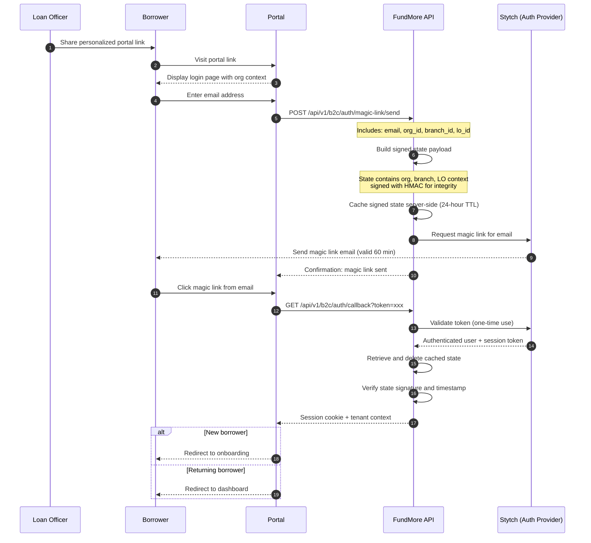
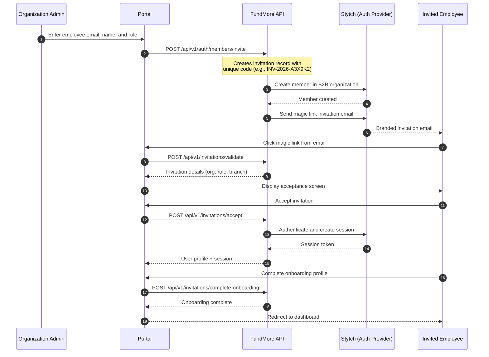
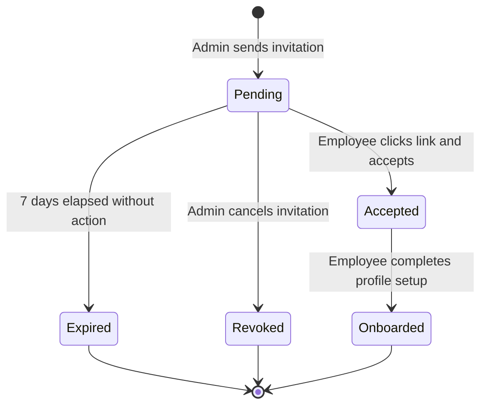
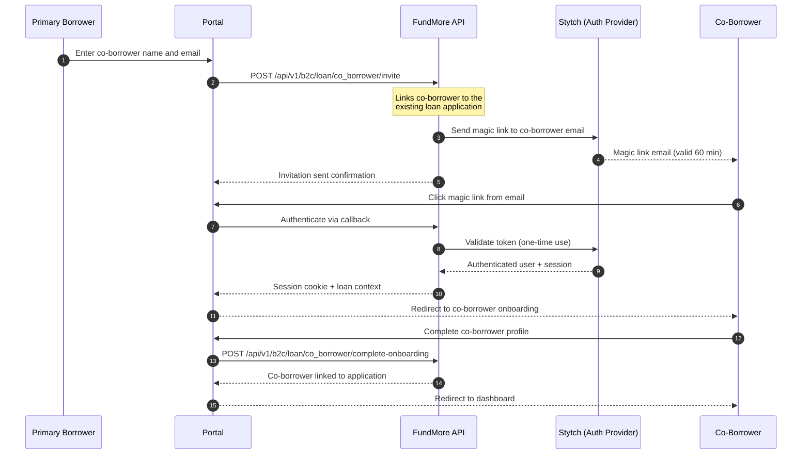

# Link Generation & Security

This page provides a detailed overview of how the FundMore platform generates authentication and invitation links for all user types, the security architecture that protects them, and how the authentication provider (Stytch) is integrated into the flow.

---

## Overview

The platform uses **passwordless magic links** as the primary authentication method. Links are generated differently depending on the user type:

| User Type | Link Method | Initiated By | Auth Method |
|-----------|------------|--------------|-------------|
| **Consumer (Borrower)** | Magic link email | Loan officer shares invite URL, or borrower visits portal | Passwordless magic link |
| **Employee (Loan Officer, Admin)** | Magic link email or password | Organization admin sends invitation | Magic link or password |
| **Co-Borrower (Spouse)** | Magic link email | Primary borrower sends invite | Passwordless magic link |

All authentication is handled through **Stytch**, a dedicated identity and access management provider. The platform uses Stytch's server-side API — no client-side SDK is exposed to the browser, ensuring all authentication logic is controlled server-side.

---

## Consumer (B2C) Link Generation

### Personalized Portal Link

Loan officers share a personalized URL that pre-assigns borrowers to their branch and loan officer profile:

```
https://{branch}-{org}.miralabs.ai/login/consumer?org_id={uuid}&branch_id={uuid}&lo_id={uuid}
```

| Parameter | Purpose |
|-----------|---------|
| `org_id` | Identifies the mortgage organization |
| `branch_id` | Assigns the borrower to a specific branch |
| `lo_id` | Assigns the borrower to a specific loan officer |

When a borrower visits this link, the portal captures the organization context. Once the borrower enters their email address, the magic link flow begins.

### Magic Link Flow



#### How the State Payload Works

When a magic link is sent, the API creates a state payload containing the full tenant context (organization, branch, loan officer). This payload is:

1. **Signed** using HMAC (a standard cryptographic message authentication code) to prevent tampering
2. **Cached server-side** with a 24-hour time-to-live
3. **Never passed through the email link** — only the authentication token appears in the URL
4. **Retrieved server-side** during the callback using the authenticated email address
5. **Deleted after retrieval** — it cannot be reused

This ensures that even if a link is intercepted, the organization context cannot be modified or replayed.

---

## Employee (B2B) Link Generation

### Invitation Flow

Organization admins invite employees (loan officers, processors, branch admins) through the admin portal. The platform generates a tracked invitation with a unique code and sends a magic link email.



### Invitation Lifecycle

Each B2B invitation follows a tracked lifecycle:



| Property | Detail |
|----------|--------|
| **Invitation code format** | `INV-{YEAR}-{RANDOM}` (e.g., `INV-2026-A3X9K2`) |
| **Expiry** | 7 days from creation |
| **Statuses** | Pending, Accepted, Onboarded, Expired, Revoked |
| **Email tracking** | Initial send time and reminder send time are recorded |
| **Re-send** | Admins can re-send the invitation email if it hasn't been accepted |

### Password Authentication (B2B Only)

In addition to magic links, B2B employees can authenticate using passwords. Password authentication includes:

- **Strength validation** — Passwords are evaluated using the ZXCVBN algorithm, which measures real-world password strength beyond simple character rules
- **Breach detection** — Passwords are checked against known data breach databases on both creation and login
- **Rate limiting** — 5 failed attempts per email or 20 per IP triggers a 15-minute lockout
- **Session duration** — Configurable, default 24 hours

---

## Co-Borrower Invite Flow

Primary borrowers can invite a co-borrower (typically a spouse) to the loan application. The co-borrower receives a magic link email and completes their own profile.



The co-borrower is automatically linked to the primary borrower's loan application. Both borrowers can independently view and update their own sections of the application.

---

## Stytch Integration

The platform integrates with [Stytch](https://stytch.com) as its identity and access management provider. Stytch handles token generation, email delivery, session management, and user lifecycle.

### Architecture

The integration is **API-only** (server-side). All communication with Stytch happens through the FundMore backend — no Stytch SDK runs in the browser. This provides:

- Full server-side control over authentication logic
- No exposure of auth provider credentials to the client
- Ability to inject custom business logic (tenant resolution, role assignment) into the auth flow

### Two Stytch Projects

| Project | Vertical | Purpose |
|---------|----------|---------|
| **Consumer Portal** | B2C (Consumer) | Handles borrower and co-borrower authentication |
| **Platform Production** | B2B (Organization) | Handles employee authentication with organization membership |

### B2C Configuration (Consumer Portal)

| Setting | Value |
|---------|-------|
| **Authentication method** | Passwordless magic links only |
| **Magic link delivery** | Email (branded template) |
| **Session duration** | 60 minutes (Stytch-side max), extended by application session management |
| **Account lockout** | 10 failed attempts triggers a 1-hour lockout |
| **Self-registration** | Supported — new users are created on first magic link authentication |
| **User data** | Tenant context (organization, branch, loan officer) stored as trusted metadata |

### B2B Configuration (Platform Production)

| Setting | Value |
|---------|-------|
| **Authentication methods** | Magic links + password |
| **Self-onboarding** | Disabled — employees must be invited by an admin |
| **Organization membership** | Required — users must belong to a Stytch organization |
| **Password policy** | ZXCVBN strength validation + breach detection on creation and login |
| **Session duration** | 60 minutes (Stytch-side max), extended by application session management |
| **Account lockout** | 10 failed attempts triggers a 1-hour lockout |
| **Email templates** | Branded "Company Invitation" template for employee invites |

### How Stytch Magic Links Work

1. **Link generation** — The FundMore API requests a magic link from Stytch for a given email address, specifying the callback URL
2. **Email delivery** — Stytch sends a branded email containing a unique, cryptographically secure token
3. **Token validation** — When the user clicks the link, the token is sent to the FundMore API, which validates it with Stytch
4. **One-time consumption** — The token is invalidated after first use; subsequent clicks return an error
5. **Session creation** — On successful validation, Stytch returns a session token that the FundMore API uses to establish the user's session

---

## Security Architecture

### Security Layers

The platform applies multiple layers of security to every authentication link and session:

#### 1. Cryptographically Signed State

The tenant context (organization, branch, loan officer assignment) is signed using HMAC, a standard cryptographic message authentication code. This signature:

- Is computed server-side using a secret key that is never exposed
- Ensures any modification to the context is detected and rejected
- Includes a timestamp to prevent old payloads from being reused

#### 2. One-Time Use Tokens

Every magic link token can only be used once. After the first click, the token is consumed and cannot be replayed. This is enforced by Stytch at the infrastructure level.

#### 3. Server-Side State Management

The signed state payload is stored server-side and deleted after retrieval. This means:

- No sensitive context travels through the email link URL
- State cannot be reused across multiple authentication attempts
- The server maintains full control over the authentication context

#### 4. Time-Based Expiry

| Component | Expiry | Purpose |
|-----------|--------|---------|
| Magic link token | **60 minutes** | Prevents stale or forgotten links from being used |
| Cached state | **24 hours** | Allows for email delivery delays |
| B2B invitation | **7 days** | Gives employees time to accept |
| Session | **Configurable** (default 60 min Stytch-side) | Limits session duration |

#### 5. Secure Session Storage

After authentication, the session is stored as an **HttpOnly cookie**. This means:

- JavaScript running in the browser **cannot access** the session token
- The session is automatically sent with every request by the browser
- Protection against cross-site scripting (XSS) token theft
- Combined with SameSite cookie attributes for CSRF protection

#### 6. Tenant Isolation

Every API request is scoped to the authenticated user's tenant. Even with a valid session:

- Users cannot access data belonging to another organization
- Cross-tenant requests are blocked and logged
- Branch-level isolation further restricts access within an organization

#### 7. Account Protection

| Protection | Detail |
|-----------|--------|
| **Rate limiting** | 5 failed attempts per email or 20 per IP triggers a 15-minute lockout |
| **Account lockout** | 10 consecutive failures trigger a 1-hour lockout (enforced by Stytch) |
| **Breach detection** | B2B passwords checked against known breach databases |
| **HTTPS only** | All links and API calls are transmitted over encrypted connections |

### Security Guarantees Summary

| Threat | How It Is Mitigated |
|--------|-----------|
| **Link tampering** (modifying org or branch context) | HMAC signature verification — any change invalidates the link |
| **Replay attacks** (reusing a link) | One-time token consumption + server-side state deletion after use |
| **Expired or stale links** | 60-minute token expiry + timestamp validation on state payloads |
| **Session hijacking via XSS** | HttpOnly cookies — session tokens are inaccessible to JavaScript |
| **Cross-tenant data access** | Tenant isolation enforced on every API request |
| **Brute-force attacks** | Rate limiting + account lockout after repeated failures |
| **Credential stuffing** (B2B passwords) | ZXCVBN password strength + breach database checking |
| **Man-in-the-middle interception** | HTTPS-only transport for all communications |
| **Unauthorized employee access** | Invite-only B2B onboarding — no self-registration |

---

## API Reference (High-Level)

### Consumer (B2C) Endpoints

| Endpoint | Method | Description |
|----------|--------|-------------|
| `/api/v1/b2c/auth/magic-link/send` | POST | Send a magic link to a borrower's email |
| `/api/v1/b2c/auth/callback` | GET | Callback handler after borrower clicks magic link |
| `/api/v1/b2c/auth/complete-onboarding` | POST | Complete new borrower onboarding |
| `/api/v1/b2c/auth/session/revoke` | POST | Logout / end borrower session |
| `/api/v1/b2c/loan/co_borrower/invite` | POST | Invite a co-borrower to a loan application |
| `/api/v1/b2c/loan/co_borrower/complete-onboarding` | POST | Complete co-borrower onboarding |

### Employee (B2B) Endpoints

| Endpoint | Method | Description |
|----------|--------|-------------|
| `/api/v1/auth/discovery/organizations` | POST | Discover which organization an email belongs to |
| `/api/v1/auth/magic-link/send` | POST | Send a magic link to an employee's email |
| `/api/v1/auth/magic-link/authenticate` | GET | Callback handler after employee clicks magic link |
| `/api/v1/auth/password/authenticate` | POST | Authenticate with email and password |
| `/api/v1/auth/members/invite` | POST | Invite a new employee to the organization |
| `/api/v1/invitations/validate` | POST | Validate an invitation code (without consuming it) |
| `/api/v1/invitations/{code}/accept` | POST | Accept an invitation and create the employee account |
| `/api/v1/invitations/complete-onboarding` | POST | Complete employee onboarding |
| `/api/v1/auth/session/exchange` | POST | Exchange a token for a full session |
| `/api/v1/auth/session/revoke` | POST | Logout / end employee session |

---

## Related Pages

- [Authentication](./authentication) — Login flows, RBAC, multi-tenant architecture, and session management
- [Borrower Portal](./b2c-borrower-portal) — What happens after B2C login
- [Loan Officer Portal](./b2b-loan-officer-portal) — What happens after B2B login
- [POS Flow Reference](./pos-flow-reference) — Sequence diagrams for all major platform flows
