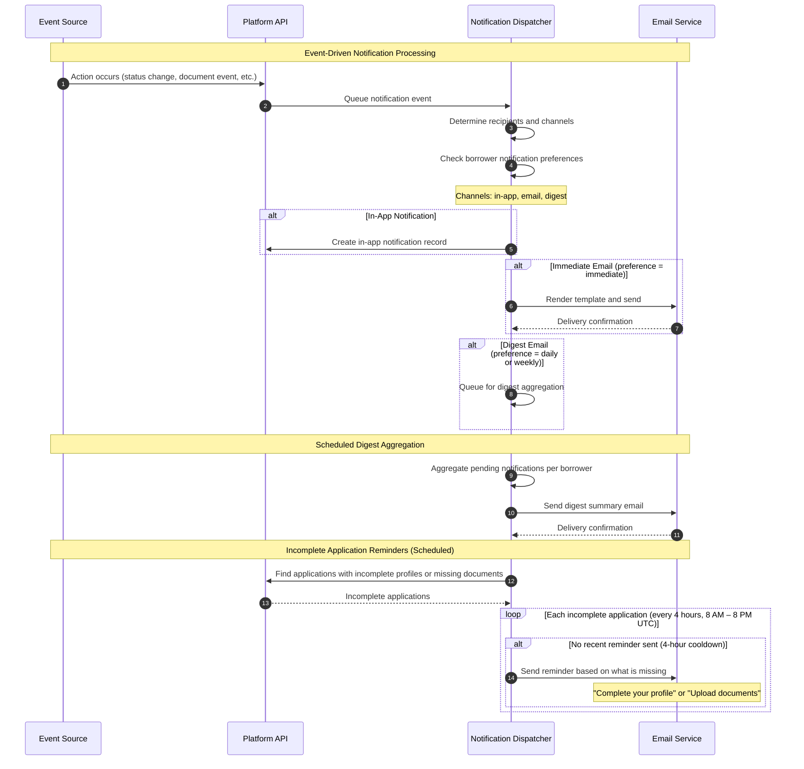
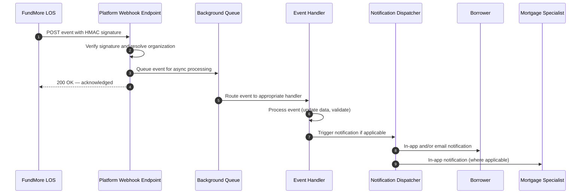

# Notifications

The platform delivers notifications through multiple channels: **in-app notifications**, **immediate email**, **digest email**, and **real-time updates**. Notifications keep borrowers informed about application progress and alert mortgage specialists to new activity.

---

## Notification Flow



---

## Notification Triggers

The platform generates notifications for the following events. Each trigger delivers to the appropriate channel (in-app, email, or both) and respects borrower notification preferences.

### Loan Status Notifications

When a loan application status changes, notifications are sent to the borrower and, where applicable, the assigned mortgage specialist.

| Status | Borrower Notification | Specialist Notification |
|---|---|---|
| **Submitted** | In-app + Email — "Your application has been submitted and is being reviewed" | In-app — "New application submitted by the borrower" |
| **Processing** | In-app + Email — "Your application is now being processed" | — |
| **Underwriting** | In-app + Email — "Your application is now in underwriting review" | — |
| **Approved** | In-app + Email — "Your application has been approved" | In-app — "Application approved" |
| **Conditionally Approved** | In-app + Email — "Your application has been conditionally approved" | In-app — "Application conditionally approved" |
| **Denied** | In-app + Email — "We have an update regarding your application" | In-app — "Application denied" |
| **Closed** | In-app + Email — "Your loan has been closed" | — |
| **Cancelled** | In-app + Email — "Your application has been cancelled" | — |

For any other status value, a generic status update notification is sent to the borrower.

All borrower status notifications include the assigned mortgage specialist's contact details (name, email, phone) so borrowers always know who to reach.

### Document Notifications

| Event | Borrower Notification | Specialist Notification |
|---|---|---|
| **Documents requested** | In-app + Email — "New documents have been requested for your application" | — |
| **Document uploaded** | — (borrower already knows) | In-app — "Borrower has uploaded a document for review" |
| **Document approved** | In-app — "Your document has been approved" | — |
| **Document rejected** | In-app — "A document you submitted needs attention. Please review and re-upload" | — |

### New Application Notification

When a borrower starts a new application, the assigned mortgage specialist receives an in-app notification alerting them to the new lead.

### Reminder Notifications

The platform automatically identifies borrowers with incomplete applications and sends targeted reminders:

| Reminder Type | Trigger | Notification |
|---|---|---|
| **Incomplete profile** | Missing SIN (Social Insurance Number) or missing/incomplete employment and income details | In-app + Email — "Your application profile is incomplete. Please complete your profile to continue." |
| **Missing documents** | Documents have been requested but not yet uploaded | In-app + Email — "Documents are still needed for your application. Please upload the required documents to proceed." |

Reminder notifications include the assigned mortgage specialist's contact details.

### Generic LOS Notifications

When the external LOS sends a notification event that does not match a specific template, it is delivered to the borrower as a generic notification through the standard in-app and email channels.

---

## FundMore LOS Inbound Notifications

FundMore LOS pushes real-time events to the platform via an inbound webhook endpoint. These events are processed asynchronously and can trigger in-app notifications, emails, and data updates within the platform.

### How It Works



### Inbound Event Types

The platform processes four categories of inbound events from FundMore LOS:

#### Loan Events

| Event | Platform Action | Notification |
|---|---|---|
| **Loan status change** | Updates application status | Borrower and specialist notified (see Loan Status Notifications above) |
| **Loan update** | Syncs loan data fields from LOS | — |
| **Loan created** | Acknowledges loan creation in LOS | — |
| **Loan closed** | Updates status to closed | Borrower notified — "Your loan has been closed" |

#### Document Events

| Event | Platform Action | Notification |
|---|---|---|
| **Document uploaded** | Marks document as uploaded | Specialist notified — "Borrower has uploaded a document" |
| **Document requested** | Creates document requirements on the application | Borrower notified — "New documents have been requested" |
| **Document approved** | Updates document status | Borrower notified — "Your document has been approved" |
| **Document rejected** | Updates document status and stores rejection reason | Borrower notified — "A document needs attention" |

#### Borrower Events

| Event | Platform Action | Notification |
|---|---|---|
| **Borrower update** | Syncs borrower details (name, email, phone, date of birth) | — |
| **Borrower created** | Acknowledges borrower creation | — |

#### Notification Trigger Events

FundMore LOS can explicitly request the platform to send a notification to a borrower. The platform routes these based on the notification type:

- **Loan status notifications** — Routed through the standard loan status notification flow
- **Document notifications** — Routed through the standard document notification flow (request, approved, rejected)
- **Custom notifications** — Any unrecognized type is delivered as a generic notification with the subject and message provided by the LOS

All inbound notification triggers respect borrower preferences — if a borrower has opted out of a category or set digest delivery, the notification is handled accordingly.

### Signature Verification

Inbound webhooks from FundMore LOS are verified using HMAC-SHA256 signatures. Each request includes:

| Header | Description |
|---|---|
| `X-Webhook-Signature` | HMAC-SHA256 signature of the payload |
| `X-Webhook-Timestamp` | Unix timestamp — requests outside the tolerance window are rejected |
| `X-Webhook-Id` | Unique event identifier for deduplication |

### Retry and Error Handling

- Events that fail processing are retried with **exponential backoff**
- Each event has a maximum retry count before it is marked as permanently failed
- Duplicate events are automatically deduplicated based on the webhook ID

---

## In-App Notifications

In-app notifications appear in the notification panel within the portal and are delivered in real-time.

### B2B Notification Endpoints

| Method | Endpoint | Description |
|---|---|---|
| `GET` | `/api/v1/b2b/loan/notification/` | List notifications for the authenticated mortgage specialist |
| `PUT` | `/api/v1/b2b/loan/notification/` | Mark notifications as read |

**Query Parameters (GET)**:

| Parameter | Type | Default | Description |
|---|---|---|---|
| `page` | int | 1 | Page number |
| `page_size` | int | 100 | Results per page (max 500) |
| `is_unread` | bool | false | Filter to unread only |

**Request Body (PUT)**:
```json
{
  "notification_ids": ["id-1", "id-2"]
}
```

### B2C Notification Endpoints

| Method | Endpoint | Description |
|---|---|---|
| `GET` | `/api/v1/b2c/notifications/` | List notifications for the authenticated borrower |
| `PUT` | `/api/v1/b2c/notifications/` | Mark notifications as read |

Same query parameters and request body format as B2B.

---

## Email Notifications

The platform sends transactional emails through **Azure Communication Services (ACS)**.

### Email Use Cases

| Use Case | Trigger | Recipient |
|---|---|---|
| Magic link | Login request | User (B2B or B2C) |
| Employee invitation | Admin invites a team member | Invited employee |
| Application confirmation | Borrower submits application | Borrower |
| Documents requested | Specialist requests documents | Borrower |
| Document approved | Specialist approves a document | Borrower |
| Document rejected | Specialist rejects a document | Borrower |
| Status update | Application status changes | Borrower |
| New application alert | Borrower starts an application | Assigned mortgage specialist |
| Incomplete profile reminder | Profile missing SIN or employment details | Borrower |
| Missing documents reminder | Requested documents not yet uploaded | Borrower |
| Daily digest | Scheduled aggregation of notifications | Borrower |
| Weekly digest | Scheduled aggregation of notifications | Borrower |

### Email Endpoints

| Method | Endpoint | Description |
|---|---|---|
| `GET` | `/api/v1/b2c/notifications/email/health` | Check whether email service is configured and available |
| `POST` | `/api/v1/b2c/notifications/email/test` | Send a test email to verify configuration |

---

## Digest Emails

The platform supports digest emails that aggregate notifications into a summary, grouped by category.

### Daily Digest

- **Schedule** — Sent daily at **8:00 AM UTC**
- Summarizes all undigested notifications from the previous 24 hours
- Groups notifications by category (loan updates, document requests, status changes, reminders)
- Includes the assigned mortgage specialist's contact details

### Weekly Digest

- **Schedule** — Sent every **Monday at 8:00 AM UTC**
- Summarizes all undigested notifications from the previous 7 days
- Groups by category with mortgage specialist contact details

### Digest Behavior

- Only notifications matching the borrower's digest preference categories are included
- Notifications are only marked as "digested" after a successful email send — failed sends are retried in the next cycle
- Borrowers must have a valid email address on file

---

## Notification Preferences (B2C)

Borrowers can configure granular notification preferences per channel and event category.

### Channels

| Channel | Description |
|---|---|
| `email` | Email notifications |
| `sms` | SMS notifications |
| `push` | Push notifications |

### Event Categories

| Category | Description |
|---|---|
| `loan_updates` | Updates about loan application progress |
| `document_requests` | Requests for additional documents |
| `status_changes` | Changes to application status |
| `reminders` | Reminders about pending actions |
| `marketing` | Promotional content and offers |
| `system` | Important system notifications |

### Frequencies

| Frequency | Description |
|---|---|
| `immediate` | Receive notifications immediately |
| `daily_digest` | Receive a daily summary |
| `weekly_digest` | Receive a weekly summary |

### Default Preferences

When a borrower first accesses their preferences, the following defaults are created:

| Category | Email Enabled | Default Frequency |
|---|---|---|
| Loan updates | Yes | Immediate |
| Document requests | Yes | Immediate |
| Status changes | Yes | Immediate |
| Reminders | Yes | Immediate |
| Marketing | No | Weekly digest |
| System | Yes | Immediate |

### Quiet Hours

Borrowers can set quiet hours per channel to suppress notifications during specific time windows (e.g., 10 PM – 8 AM). Quiet hours are timezone-aware.

### Preference Endpoints

All endpoints are under `/api/v1/b2c/notifications/preferences`.

| Method | Path | Description |
|---|---|---|
| `GET` | `/` | Get all notification preferences (creates defaults if none exist) |
| `PUT` | `/` | Bulk update multiple preferences |
| `PATCH` | `/{channel}/{category}` | Update a specific channel/category preference |
| `PATCH` | `/{category}` | Update email preference for a category (shorthand) |
| `POST` | `/opt-out` | Opt out of all notifications for a channel |
| `GET` | `/channels` | List available notification channels |
| `GET` | `/categories` | List available event categories with descriptions |
| `GET` | `/frequencies` | List available delivery frequencies |

### Preference Response Example

```json
{
  "preferences": [
    {
      "channel": "email",
      "event_category": "loan_updates",
      "is_enabled": true,
      "frequency": "immediate",
      "quiet_hours_start": "22:00",
      "quiet_hours_end": "08:00",
      "quiet_hours_timezone": "America/Toronto"
    }
  ],
  "summaries": {
    "email": {
      "channel": "email",
      "enabled_categories": ["loan_updates", "document_requests", "status_changes"],
      "disabled_categories": ["marketing"],
      "default_frequency": "immediate",
      "has_quiet_hours": true
    }
  }
}
```

---

## Incomplete Application Reminders

The platform automatically sends reminder notifications to borrowers with incomplete applications.

### Schedule

Runs every **4 hours** at **8 AM, 12 PM, 4 PM, and 8 PM (UTC)**.

### Cooldown

A **4-hour cooldown** prevents duplicate reminders to the same borrower. If a reminder was sent within the last 4 hours, the borrower is skipped.

### Reminder Triggers

The system checks each early-stage application for the following conditions (in priority order):

1. **Missing SIN** — Borrower has not provided their Social Insurance Number
2. **Missing or incomplete employment profile** — No employment record on file, or employment with zero income
3. **Pending document requirements** — Documents have been requested but not yet uploaded

Only one reminder type is sent per cycle per borrower, based on whichever condition is detected first.

### Behavior

- **Stops when** the application moves past the early stages (e.g., submitted, approved)
- **Respects preferences** — Reminders are routed through the notification dispatcher, which checks the borrower's notification preferences before sending

---

## Webhook Event Notifications

The platform's webhook system can deliver event notifications to external systems for all major platform events. For full webhook documentation including subscription management, HMAC signature verification, delivery and retry behavior, and the complete list of event types, see the [FundMore LOS Integration — Webhook System](./external-los#webhook-system) page.

---

## Real-Time Updates

Real-time updates are delivered via WebSocket connections for instant feedback in the portal. The WebSocket connection is primarily used for the AI assistant chat interface. For full details on the WebSocket connection, message types, and capabilities, see the [AI Platform — WebSocket API](./ai-platform#websocket-api) page.

---

## Related Pages

- [Borrower Portal](./b2c-borrower-portal) — How borrowers receive notifications
- [Mortgage Specialist Portal](./b2b-loan-officer-portal) — Specialist notification workflow
- [FundMore LOS Integration](./external-los) — Webhook event delivery to external systems
- [AI Platform](./ai-platform) — AI chat via WebSocket
