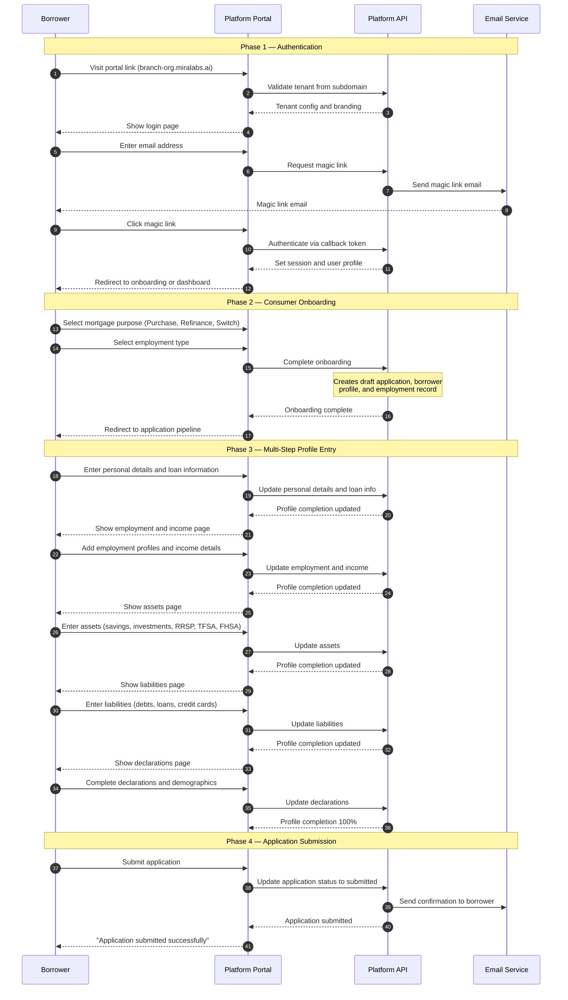
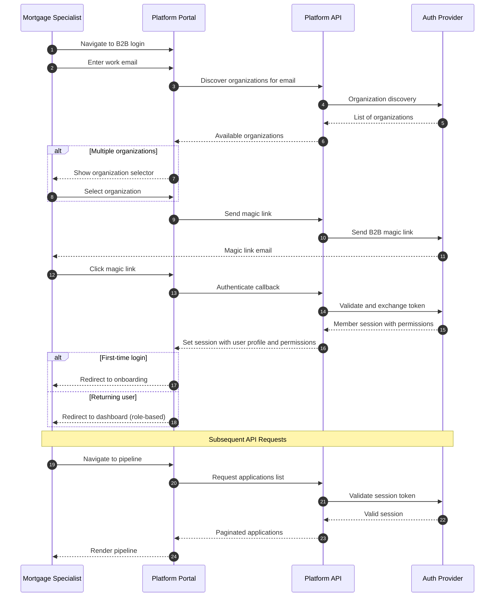
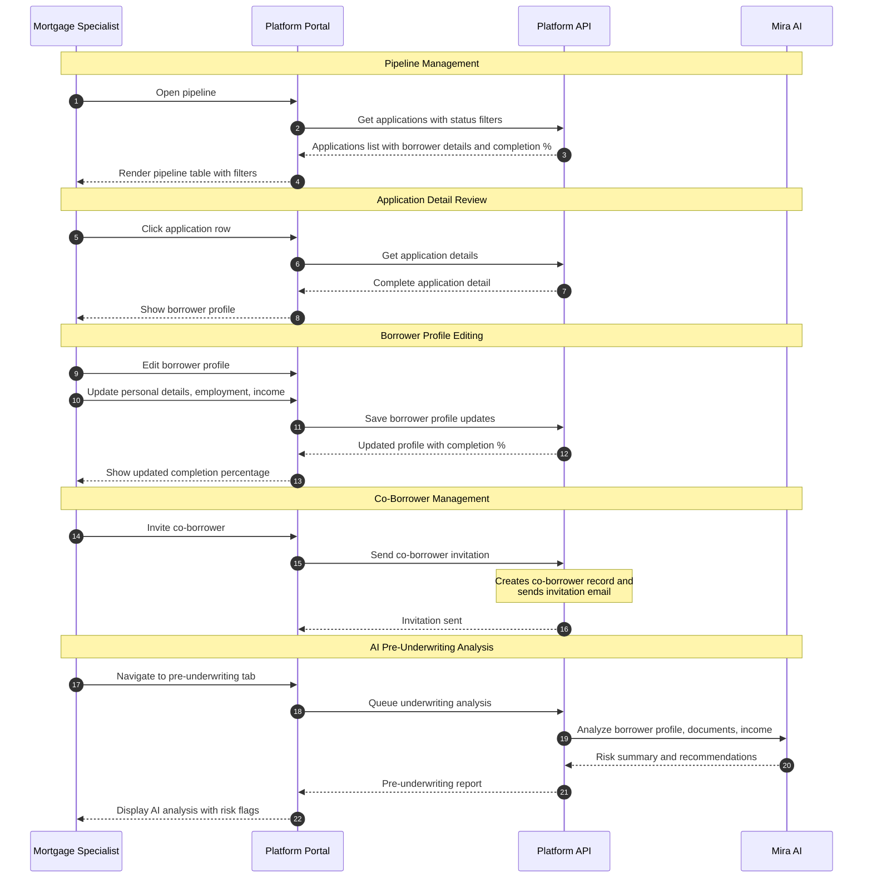
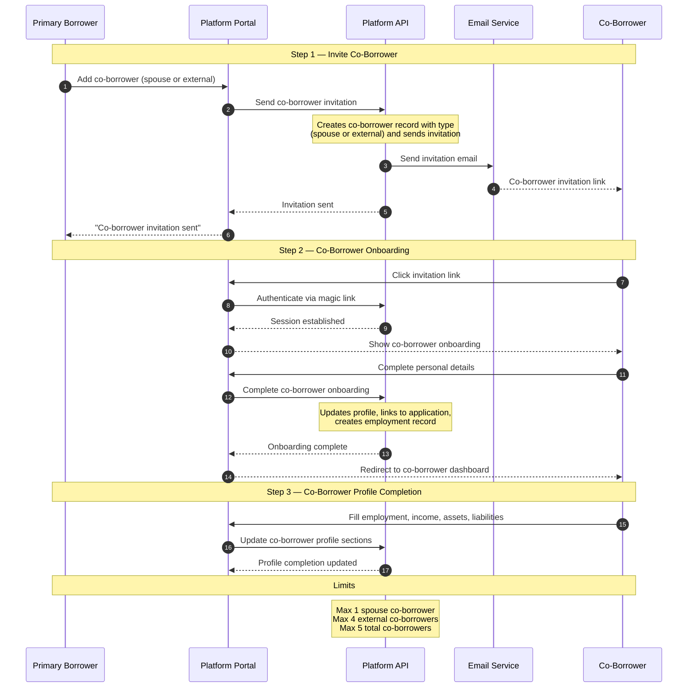
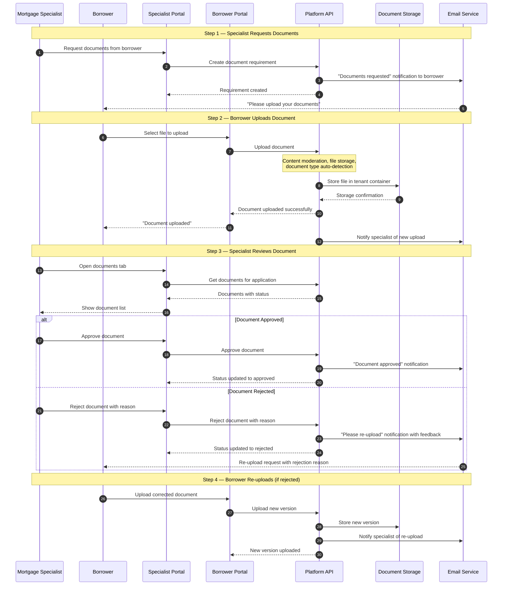
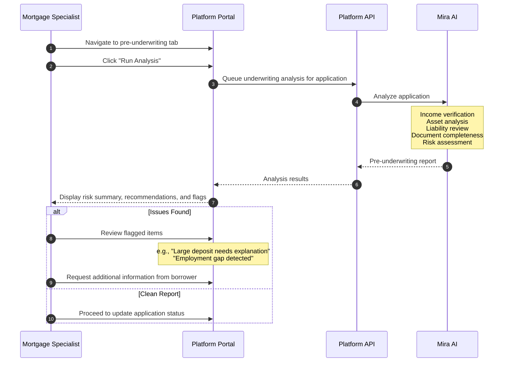
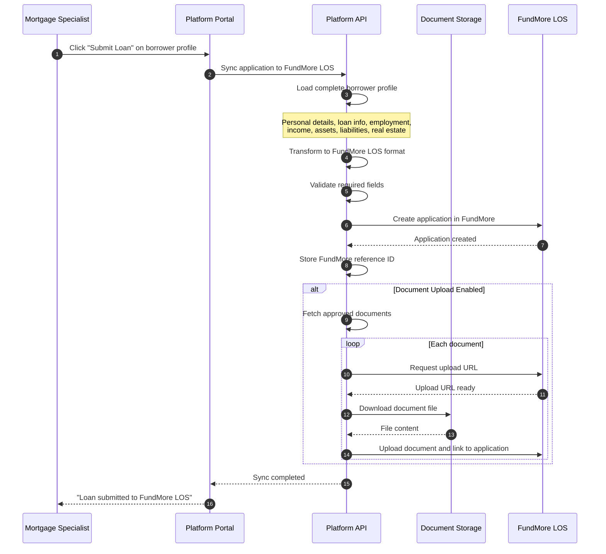
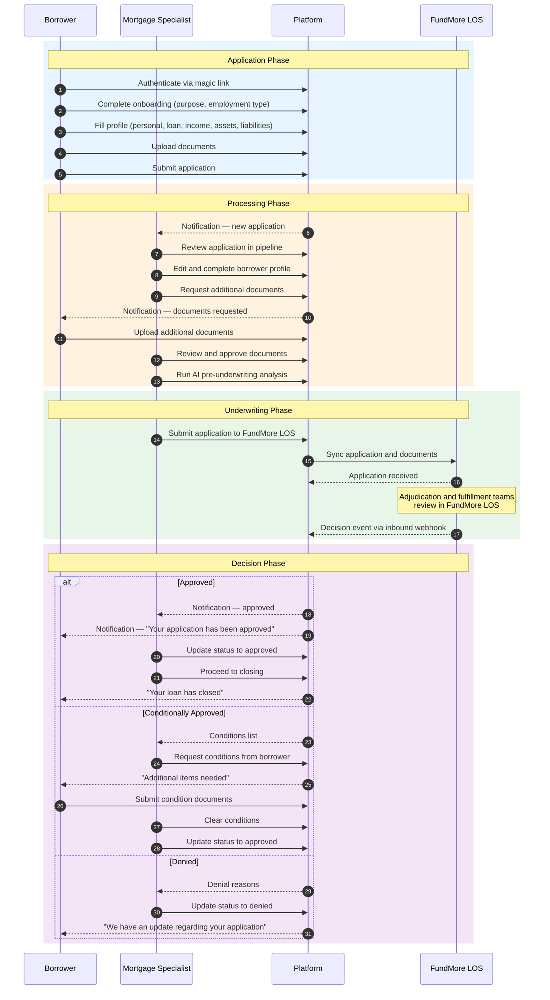
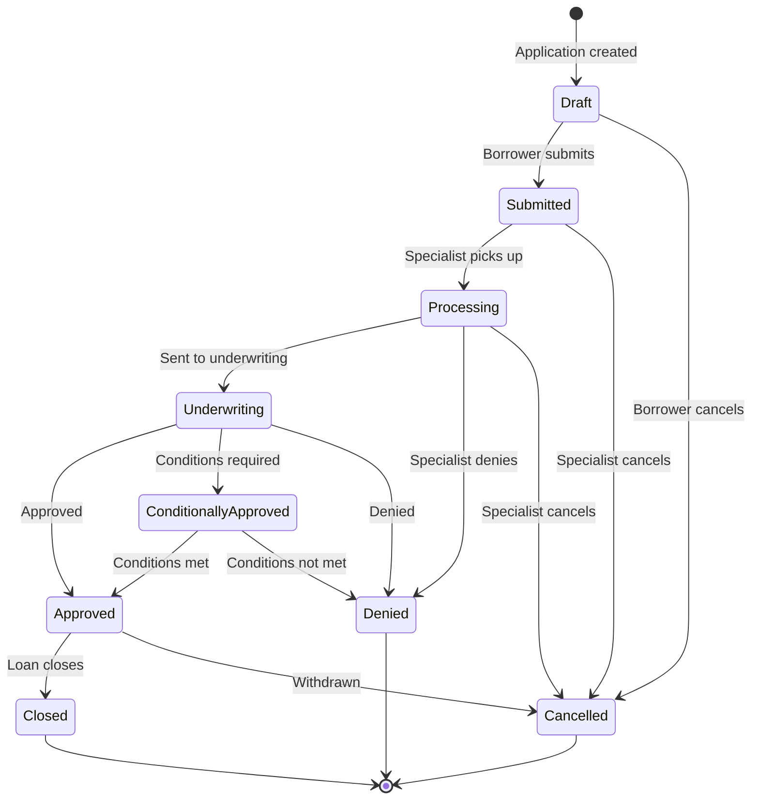
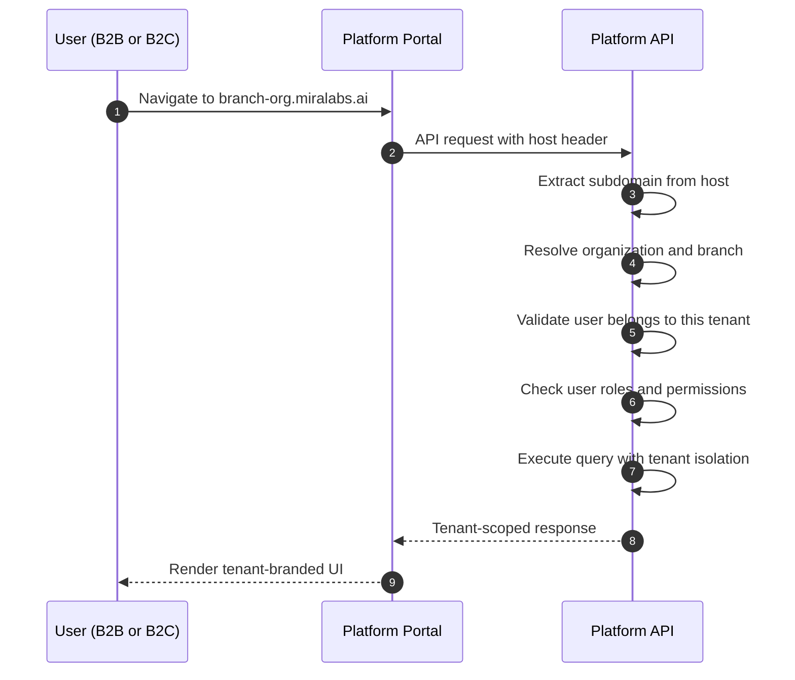

# POS Flow Reference

This page consolidates the key sequence diagrams from across the platform documentation into a single reference. Each diagram shows the interaction between actors (Borrower, Mortgage Specialist), the Platform Portal, the Platform API, and supporting services.

For detailed documentation on specific subsystems, see the linked pages within each section.

---

## Diagram Legend

| Symbol | Meaning |
|---|---|
| **Solid arrow** (`->>`) | Synchronous request |
| **Dashed arrow** (`-->>`) | Response / async callback |
| **rect** blocks | Grouped phases |
| **alt/else** blocks | Conditional branching |
| **loop** blocks | Repeated operations |
| **Note** | Additional context |

---

## 1. Borrower Application Flow

The complete flow from a borrower arriving at the portal through multi-step application submission. See [Borrower Portal](./b2c-borrower-portal) for full details.

---

## 2. Mortgage Specialist Authentication

See [Authentication](./authentication) for full details on the B2B authentication flow.

---

## 3. Pipeline and Application Review

See [Mortgage Specialist Portal](./b2b-loan-officer-portal) for full details.

---

## 4. Co-Borrower Flow

The platform supports adding co-borrowers (spouse or external) to a loan application. The co-borrower receives their own invitation and completes onboarding independently.

---

## 5. Document Lifecycle

See [Borrower Portal](./b2c-borrower-portal) and [Mortgage Specialist Portal](./b2b-loan-officer-portal) for endpoint details.

---

## 6. AI Pre-Underwriting Analysis

See [AI Platform](./ai-platform) for full details on AI capabilities.

:::info Roadmap — Credit Integration Planned
Credit bureau pulls will be integrated through FundMore LOS's existing Equifax Canada connection. See [Credit Reports](./credit) for the planned flow. Once available, the credit data will feed into the AI pre-underwriting analysis.
:::

---

## 7. FundMore LOS Application Sync

When a mortgage specialist submits a loan, the platform syncs the application and documents to FundMore LOS. See [FundMore LOS Integration](./external-los) for the full sync flow, data mapping, and API reference.

---

## 8. End-to-End Loan Lifecycle

A high-level summary combining all flows from application through to close.

---

## 9. Loan Status Lifecycle

### Status Definitions

| Status | Description |
|---|---|
| Draft | Application started but not yet submitted |
| Submitted | Borrower has completed and submitted the application |
| Processing | Mortgage specialist is reviewing and gathering documentation |
| Underwriting | Application is under formal underwriting review |
| Approved | Loan has been fully approved |
| Conditionally Approved | Approved with conditions that must be met before final approval |
| Denied | Application has been denied |
| Closed | Loan has closed (funded) |
| Cancelled | Application withdrawn or cancelled |

---

## 10. Multi-Tenant Resolution

---

## 11. Notification Flow

The platform delivers notifications through in-app, email, digest, and real-time channels. For the full notification system documentation including all triggers, digest schedules, preferences, reminders, and FundMore LOS inbound notification processing, see [Notifications](./notifications).

---

## 12. Real-Time AI Chat

Real-time AI interaction is delivered via WebSocket for the Mira AI assistant. For full details on the WebSocket connection, message types, voice input, and AI capabilities, see [AI Platform](./ai-platform).

---

## Related Pages

- [Introduction](/) — Platform overview
- [Authentication](./authentication) — Login flows and RBAC
- [Borrower Portal](./b2c-borrower-portal) — Borrower self-service experience
- [Mortgage Specialist Portal](./b2b-loan-officer-portal) — Specialist workflow
- [AI Platform](./ai-platform) — Mira AI capabilities and WebSocket
- [FundMore LOS Integration](./external-los) — LOS sync, webhooks, and external integrations
- [Notifications](./notifications) — Notification system
- [Credit Reports](./credit) — Credit integration (planned, via FundMore LOS)
- [Product & Pricing](./product-pricing) — Product rates and loan tools
